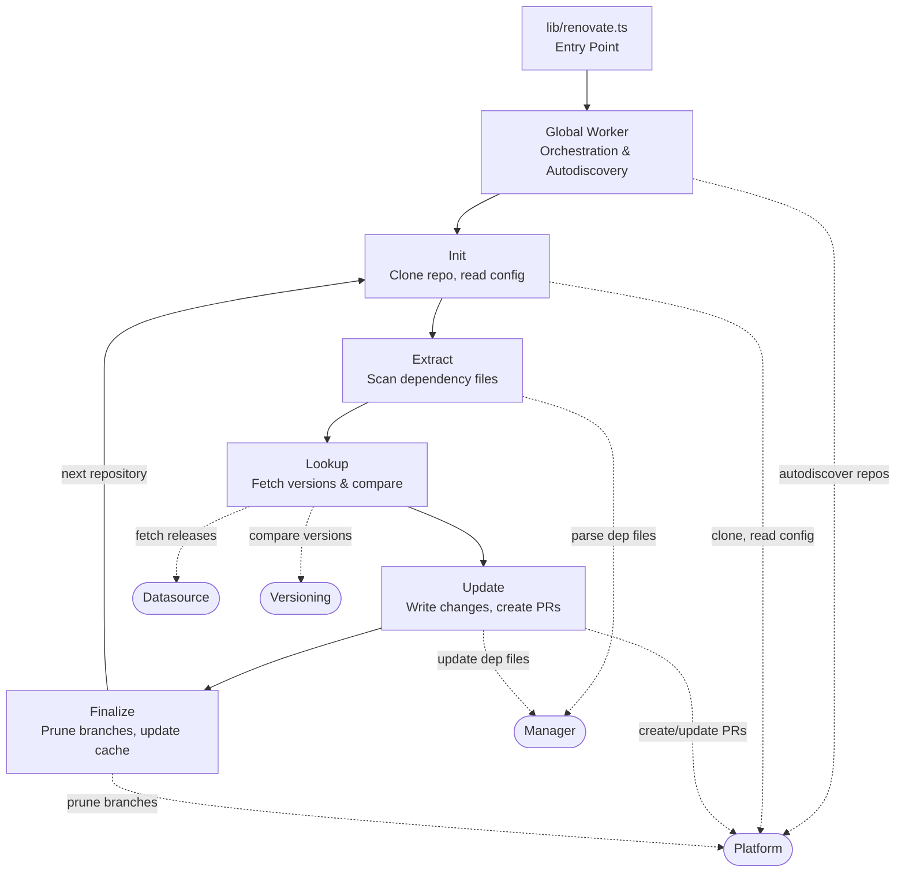

# AGENTS.md

This file provides guidance for AI agents working in this repository.

## What is Renovate?

Renovate is an automated dependency update tool that scans repositories for dependency files, checks for newer versions via datasources, and creates pull requests to update them. It supports 90+ package managers and multiple hosting platforms (GitHub, GitLab, Bitbucket, Azure DevOps, Gitea, Forgejo, Gerrit, etc.).

## Development Documentation

The **./docs/development/** directory contains detailed documentation for developers, like style guides, testing guidelines, and configuration options.

ALWAYS READ ./docs/best-practices.md for guidance on code style.

## Architecture

Renovate is an automated dependency update tool. The runtime flow is:

### Module System (`lib/modules/`)

Four module categories, each with many implementations:

- **manager/** — Detects and updates dependency files (npm, maven, dockerfile, go-mod, cargo, etc.). Each manager extracts dependencies from specific file types and knows how to update them.
- **datasource/** — Fetches version/release information from registries (npm registry, Docker Hub, GitHub releases, PyPI, etc.).
- **versioning/** — Parses and compares version strings per ecosystem (semver, docker, maven, pep440, etc.).
- **platform/** — Interacts with Git hosting APIs (GitHub, GitLab, Bitbucket, Azure DevOps, Gitea, Forgejo, Gerrit, etc.) for PRs, issues, and comments.

Each module category has an `api.ts` barrel file at its root.

### Other Key Directories

- **lib/config/** — Configuration parsing, validation, defaults, preset resolution
- **lib/util/** — Shared utilities (HTTP, git, caching, regex, template, etc.)
- **lib/workers/global/** — Top-level orchestration, autodiscovery, config loading
- **lib/workers/repository/** — Per-repository processing pipeline
- **lib/constants/** — Shared constants
- **tools/** — Build tooling, doc generation, schema generation, custom lint rules

### Generated Files

Files matching `*.generated.ts` in `lib/` are auto-generated during build (`pnpm generate:*`). Do not edit these directly.

## Raising issues/feature requests

**Do not create GitHub Issues directly.** Issue creation is restricted to repository administrators. Creating an issue as a non-administrator will result in being blocked from the repository.

Instead, use **GitHub Discussions**: https://github.com/renovatebot/renovate/discussions/new/choose

Two discussion categories are available:

- **Request help** (`.github/DISCUSSION_TEMPLATE/request-help.yml`) - for bugs, questions, or unexpected behavior. Include a minimal reproduction and relevant logs where possible.
- **Suggest an idea** (`.github/DISCUSSION_TEMPLATE/suggest-an-idea.yml`) - for feature requests or improvements.

**Do not attempt** to create a Discussion body without following the template, as it may result in being blocked from the repository.

**Security vulnerabilities must not be reported on GitHub.** See [`SECURITY.md`](./SECURITY.md) for more details.

## Contributing Notes

- PRs require 100% test coverage. Use `/* v8 ignore ... */` sparingly when tests wouldn't prove anything.
- Do not force push PR branches.
- Follow the PR template (`.github/pull_request_template.md`).

### Commands

Use `pnpm` for all commands (NOT npm/npx).

- **Install dependencies:** `pnpm install`
- **Lint / Test / Autofix:** `pnpm check --all <optional path>`
- **Full test suite:** `pnpm test` (runs lint + schema validation + all tests)
- **Run from source:** `pnpm start` or `node lib/renovate.ts`

Tests use Vitest (invoked via `pnpm vitest`). Test files use `.spec.ts` suffix and are co-located with source. Globals from `jest-extended` and `expect-more-jest` are available in tests.
