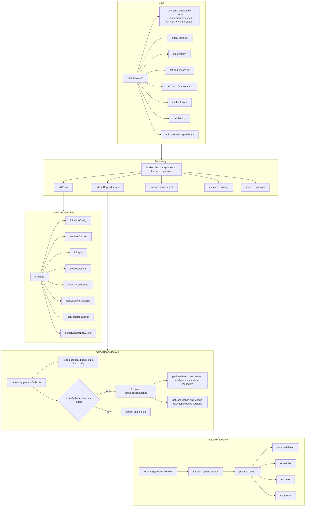

```mermaid
flowchart TB
    subgraph Start
    A[lib/renovate.ts] --> B[getConfig ordered by priority useBaseBranchConfig > Cli > ENV > file > default]
    A --> C[global initialize]
    A --> D[init platform]
    A --> E[set and ensure dir]
    A --> F[init cache limit commits]
    A --> G[init host rules]
    A --> H[validations]
    A --> I[auto discover repositories]
    end

    subgraph Repository
    J[workers/repository/index.ts, for each repository]
    J --> K[initRepo]
    J --> L[extractDependencies]
    J --> M[ensureOnboardingPr]
    J --> N[updateRepository]
    J --> O[finalize repository]
    end

    subgraph initializeRepository
    X[initRepo]
    X--> P[InitializeConfig]
    X--> Q[InitializeCaches]
    X--> R[initApis]
    X--> S[getRepoConfig]
    X--> T[checkIfConfigured]
    X--> U[applySecretsToConfig]
    X--> V[setUserRepoConfig]
    X--> W[detectVulnerabilityAlerts]
    end

    subgraph extractDependencies
    Z[repository/process/index.ts]
    Z --> AA[read dashboard body, put it into config]
    Z --> QM{if config.basebranches exists}
    QM --> |yes| AB[for each config.basebranches]
    AB --> AC[getBaseBranch and extract all dependencies from managers]
    AB --> AD[getBaseBranch and lookup new dependency versions]
    QM --> |no| AE[extract and lookup]
    end

    subgraph updateRepository
    BA[repository/process/write.ts]
    BA--> BB[for each update branch]
    BB --> BC[process branch]
    BC --> BD[do all validation]
    BC --> BF[schedules]
    BC --> BG[updates]
    BC --> BH[ensurePR]
    end

    Start ---> Repository
    K ---> initializeRepository
    L ----> extractDependencies
    N -----> updateRepository
```
