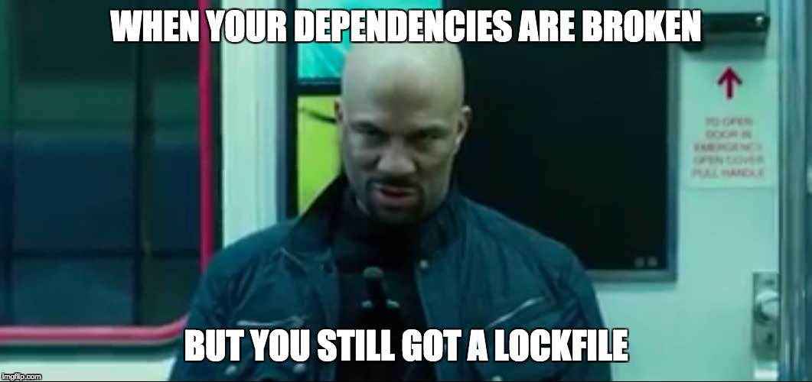

# Should you Pin your JavaScript Dependencies?

Once you start using a tool/service like Renovate, probably the biggest decision you need to make is whether to "pin" your dependencies instead of using SemVer ranges.
The answer is "It's your choice", but we can certainly make some generalisations/recommendations to help you.

If you do not want to read the in-depth discussion, and just want our recommendations, skip ahead to the ["So what's best?" section](#so-whats-best).

## What is Dependency Pinning?

To ensure we're all talking about the same thing, it's important to define exactly what we mean by dependency "pinning".

Historically, projects use SemVer ranges in their `package.json`.
For instance, if you run `npm install foobar` you will see an entry like `"foobar": "^1.1.0"` added to your `package.json`.
Verbosely, this means "any foobar version greater than or equal to 1.1.0 but less than 2".
The project will automatically use `1.1.1` if it's released, or `1.2.0`, or `1.2.1`, etc - meaning you will get not only patch updates but also feature (minor) releases too.

Another alternative is ranges like `"foobar": "~1.1.0"` which means "any foobar version greater than or equal to 1.1.0 but less than 1.2".
This narrows the range to only patch updates to the 1.1 range.

If instead you "pin" your dependencies rather than use ranges, it means you use exact entries like `"foobar": "1.1.0"` which means "use only foobar version 1.1.0 and no other".

## Why use ranges?

For projects of any type, the main reason to use ranges is so that you can "automatically" get updated releases - which may even include security fixes.
By "automatically", we mean that any time you run `npm install` you will get the very latest version matching your SemVer - assuming you're not using a lock file, that is.

### Tilde vs Caret

If you're familiar with the theory of SemVer, you might think that you only need to use tilde ranges (e.g. `"~1.1.0"`) to get bug fixes, rather than caret ranges (e.g. `"^1.1.0"`).
This is true in theory but not in practice.
The reality is that for most projects, fixes are not "backported" to previous minor releases, and minor releases themselves may include fixes.
So for example release `1.2.0` may include one new feature and one fix, so if you stick with `1.1.0` then you will miss out on the fix as there will never be a `1.1.1` once `1.2.0` is already released.
This is the _reality_ of most open source packages.

### Ranges for Libraries

A second reason for using ranges applies to "libraries" that are published as npm packages with the intention that they are used/`require()`'d by other packages.
In this case, it is usually a bad idea to pin all your dependencies because it will introduce an unnecessarily narrow range (one release!) and cause most users of your package to bloat their `node_modules` with duplicates.

For example, you might have pinned `foobar` to version `1.1.0` and another author pinned his/her `foobar` dependency to `1.2.2`.
Any user of both your packages will end up with npm trying to install two separate versions of `foobar`, which might not even work.
Even if both projects use a service like Renovate to keep their pinned dependencies up to date with the very latest versions, it's still not a good idea - there will always be times when one package has updated/released before the other one and they will be out of sync.
e.g. there might be a space of 30 minutes where your package specifies foobar `1.1.0` and the other one specifies `1.1.1` and your joint downstream users end up with a duplicate.

## Why pin dependencies?

You mainly pin versions for certainty, and visibility.
When you have a pinned version of each dependency in your `package.json`, you know exactly which version of each dependency is installed at any time.
This benefits when upgrading versions as well as when rolling back in case of problems.

<!-- prettier-ignore -->
!!! note
    We'll cover lock files later, don't worry.

### Upgrading pinned versions

Let's say that a "faulty" version `1.2.0` of `foobar` is released and it breaks one of your tests.

If you were using default caret SemVer ranges, then your `main` branch is now "broken" because its `package.json` says that any version 1.x above 1.1.0 is acceptable, and npm will choose the latest (`1.2.0`).
You would need to manually check and work out which dependency caused the failure (`foobar` may not have been the only dependency to have "automatically" upgraded since the last time your tests passed) and then you would need to pin the dependency yourself to stop `npm` installing `1.2.0`.

Consider the same situation if instead you were _pinning_ dependency versions.
Your `main` branch would not be broken because it's pinned to `foobar@1.1.0` - instead you'd just have a Pull Request for upgrading to `foobar@1.2.0` which would fail.
You'd know not to merge it and can wait for `foobar@1.2.1` or later when it's fixed.
By pinning dependencies you know exactly what you're running and you know exactly what failed.

Now consider a similar theoretical scenario where `foobar@1.2.0` is faulty but it is _not_ caught by any of your automated tests.
This is more common and more dangerous.

If you were using SemVer ranges then this new version of `foobar` will likely be deployed to production automatically one day, sometime after which you notice errors and realise you need to fix it.
Like before, you need to manually work out which dependency caused it - assuming you guess correctly that it was a new dependency version at fault - and pin it manually by editing `package.json` one dependency at a time.

Alternatively, if you were instead pinning `foobar` then you would get a PR for `foobar@1.2.0` which awaits your approval.
So first of all, you can choose to read the release notes and/or visually inspect the branch yourself before merging, hopefully saving you from pushing this faulty code to production.

If you did not catch the fault before merging, you are still better off with a pinned version.
If you discover something wrong in production, you can easily "roll back" commits in your development environment until you find which rollback fixes the problem.
Then you can simply revert that commit (reversing `foobar@1.1.0` -> `foobar@1.2.0`) and push that to `main`.
When the next release of `foobar` comes out (e.g. `1.2.1`) you will be prompted with a new PR and hopefully inspect it carefully this time before merge!

As you can see in the above, pinning dependencies makes your build more consistent and predictable as a developer.

### Downside of pinned dependencies - upgrade "noise"

The one major downside to your development workflow of pinning dependencies is the potential for increased "noise" in your repository.
As mentioned above, you can expect to get Pull Requests whenever there is a new version of your dependencies available.
Depending on how many repositories you maintain, and how many dependencies are in each, you may find this default approach to be overwhelming (e.g. waking up to 10 new Pull Requests each day).

## Reducing the "noise" of dependency updates

The increased volume of Pull Requests for upgrading dependencies may be considered by some to be undesirable "noise" in their day.
To some extent this is simply a trade-off for having your dependencies pinned and predictable, but there are also ways you can reduce this noise while still gaining the majority of the benefits:

### Pull Request automerging

There are some dependencies that either (a) don't have the potential to break something in production, or (b) are fully tested by your tests.

For example, it's very hard for `eslint` to break anything in production.
If your build/tests pass, then you are fine.
Consider enabling automerge for all lint packages to save yourself the pointless click when you manually approve them each time.
In this case you might wake up to 5/10 of your overnight Pull Requests having already merged themselves.

Another example of a good candidate for automerging might be a database driver like `node-postgres` (`pg` on npm), if you have 100% test coverage of your API.
In that case if the `pg` package has a minor or patch update and passes all tests then you may as well merge it automatically if you were not going to do a manual inspection anyway.

### Branch automerging

In the above suggestion of Pull Request automerging, you might still find it annoying if you get GitHub Notifications for every PR that is created and merged.
In that case, you could set `automergeType` to `branch`, which means Renovate will:

- Create a new branch for testing
- Wait until after tests have completed
- Push the commit directly to `main` if tests pass, or
- Raise a PR only if tests failed

With this approach, updates will be essentially "silent" - causing no notifications - but you will be able to see each commit on `main` of course.

### Scheduling

Although it can feel satisfying to get updates "immediately" when they're available, the reality is that you usually don't _need_ updates so frequently.
And worse still, npm package versions that are less than 24 hours [can be unpublished](https://blog.npmjs.org/post/141905368000/changes-to-npms-unpublish-policy), which would really break your build if you've pinned to a version that no longer exists.

So to reduce the interruptions of automated dependency updates, consider putting Renovate on a schedule, such as:

- Update only on weekends? This way you update packages at most once per week, _and_ your CI build runners are likely to be idle anyway
- Update daily, but between hours like midnight and 5am? That way notifications don't pop up in people's feed while they're working, _and_ you also get the benefit of not tying up build machines when developers need to use them

To learn all about controlling Renovate's schedule, read the [key concepts, scheduling](https://docs.renovatebot.com/key-concepts/scheduling/) docs.

### Grouping related packages

Although it's good to isolate each dependency update for ease of troubleshooting, there are times when the extra noise isn't worth it, or when packages naturally belong together anyway (such as all `babel` packages).
You can add a package rule in our Renovate configuration to group these together and you'll get just one branch combined even if multiple packages have updates available.

## Pinning Dependencies and Lock Files

Since both `yarn` and `npm@5` both support lock files, it's a common question to ask "Why should I pin dependencies if I'm already using a lock file?".
It's a good question!

{ loading=lazy }

Lock files are a great companion to SemVer ranges _or_ pinning dependencies, because these files lock (pin) deeper into your dependency tree than you see in `package.json`.

### What a lock file will do for you

When kept in sync with its associated `package.json`, a lock file will further lock down the exact dependencies and _sub_-dependencies that your project uses, so that everyone running `npm install` or `yarn install` will install the exact same dependencies as the person or bot that last updated the lock file.

To reuse an earlier example, this means that you could have `foobar@^1.1.0` in your `package.json` and be locked to `1.1.0` in your lock file, so that when the broken `foobar@1.2.0` is released, nobody on the team installs it.

### What a lock file doesn't do for you

If a lock file gets out of sync with its `package.json`, it can no longer be guaranteed to lock anything, and the `package.json` will be the source of truth for installs.

The lock file has only delayed the inevitable problem, and provides much less visibility than `package.json`, because it's not designed to be human readable and is quite dense.

{ loading=lazy }

If the `package.json` has a range, and a new in-range version is released that would break the build, then essentially your `package.json` is in a state of "broken", even if the lock file is still holding things together.

The upside is that the lockfile will hold back `foobar` to `1.1.0` unless it's forced to upgrade, so the break is postponed.
The downside is _how_ you will discover the break eventually.

The easiest case is if for some reason you _need_ to upgrade `foobar`, e.g. for a new feature it has, so you might run something like `yarn upgrade foobar`.
Then you might either discover the break during your development or when you push your new development to CI for testing.
In this case, hopefully you'll guess it's `foobar` that broke it and not your own code.

Alternatively, maybe someone thinks "This lockfile is probably really out of date and might be missing some essential patches" and decides to `yarn upgrade` the whole thing in one go.
No doubt the diff will be full of green and red as many direct and indirect dependencies will have changed versions.
Then it's pushed to CI for testing, fails, and you have to guess which of the changes caused it until you eventually narrow it down to `foobar`.
This might require even manually looking through the lock file diffs line by line.
Maybe dep `blahblah` also broke at the same time, to make it even harder.

By ceding control of direct dependency versions to the lock file, you have lost the ability to _know_ when things are updated.
You also may be missing out on really important patches you're not even aware of, because they're "in range" yet locked back to vulnerable or buggy versions in the lock file.

Reconsider the same scenario if `foobar` had instead been pinned to `1.1.0` in `package.json`.
The (broken) upgrade to `1.2.0` would have been explicitly proposed to you via a Renovate PR, you would see the break, and know that the version is bad.
Meanwhile you could be upgrading all the other essential fixes of other dependencies without worrying about `foobar`.
You could even be running `yarn upgrade` regularly to be getting _indirect_ package updates in the lockfile and seeing if everything still passes.

So the lock file does not solve the same SemVer problems that pinning solves - but it compliments it.
For this reason our usual recommendation using a lock file regardless of whether you pin dependencies or not, and pinning even if you have a lock file.

Don't forget though that our motto is "Flexible, so you don't need to be", so go ahead and configure however you want.
Also, we're open to ideas for how to make lock file updates more "visible" too.
e.g. are you interested in a Renovate feature where you get a lockfile-only PR any time a direct dependency gets an in-range update?

## What about indirect/sub-dependencies?

A good argument made by [@LinusU](https://github.com/LinusU) is:

> pinning will only protect you against breakage in a, in many cases, small percentage of your packages. If you for example have installed express and pinned it, you will only protect yourself against a bad express release, it will not help with the 30 dependencies that express has.
>
> Because of this, I personally think that pinning dependencies just creates a false sense of security, and that using a lock file is superior in every way.

It is true that pinning applies only to direct dependencies, and "indirect" dependencies typically count for a lot more in total in your lockfile than direct.
e.g. those 30 ones that Express relies on.

Does pinning give you "increased" security?
Undeniably.
The question is not whether it does, but whether that increased security comes at a cost (e.g. "noise").
But Linus also points out that a _false_ sense of security is a cost too.

Don't forget that there is some form of transitive trust too.
You need to pick your direct dependencies carefully, and which versions of them you use.
Hopefully in doing that you pick dependencies partly for how well _they_ look after their own dependencies and versions (e.g. do they have good enough test coverage, do they use something like Renovate to keep updated, etc?).
So the reality is that even if 90% of the entries in your lock file are indirect dependencies, those are ones you have somewhat "delegated" responsibility for to your dependencies.
e.g. I'd hope that Express are even better at watching their dependencies for breaks than I am, to use the example above.

But certainly "does it give a false sense of security" is not a question we can really answer quantifiably.

## So what's best?

We recommend:

1. Any apps (web or Node.js) that aren't `require()`'d by other packages should pin all types of dependencies for greatest reliability/predictability
2. Browser or dual browser/node.js libraries that are consumed/`required()`'d by others should keep using SemVer ranges for `dependencies` but can use pinned dependencies for `devDependencies`
3. Node.js-only libraries can consider pinning all dependencies, because application size/duplicate dependencies are not as much a concern in Node.js compared to the browser. Of course, don't do that if your library is a micro one likely to be consumed in disk-sensitive environments
4. Use a lock file

As noted earlier, when you pin dependencies then you will see an increase in the raw volume of dependency updates, compared to if you use ranges.
If/when this starts bothering you, add Renovate rules to reduce the volume, such as scheduling updates, grouping them, or automerging "safe" ones.

## References

This is a "living" document and we plan to update it whenever we think of something new or someone makes a valid point we've missed or misunderstood.

Updated 2018-01-19 after [excellent feedback on lockfiles](https://github.com/commitizen/cz-conventional-changelog-default-export/pull/4#issuecomment-358038966) by [@LinusU](https://github.com/LinusU)
