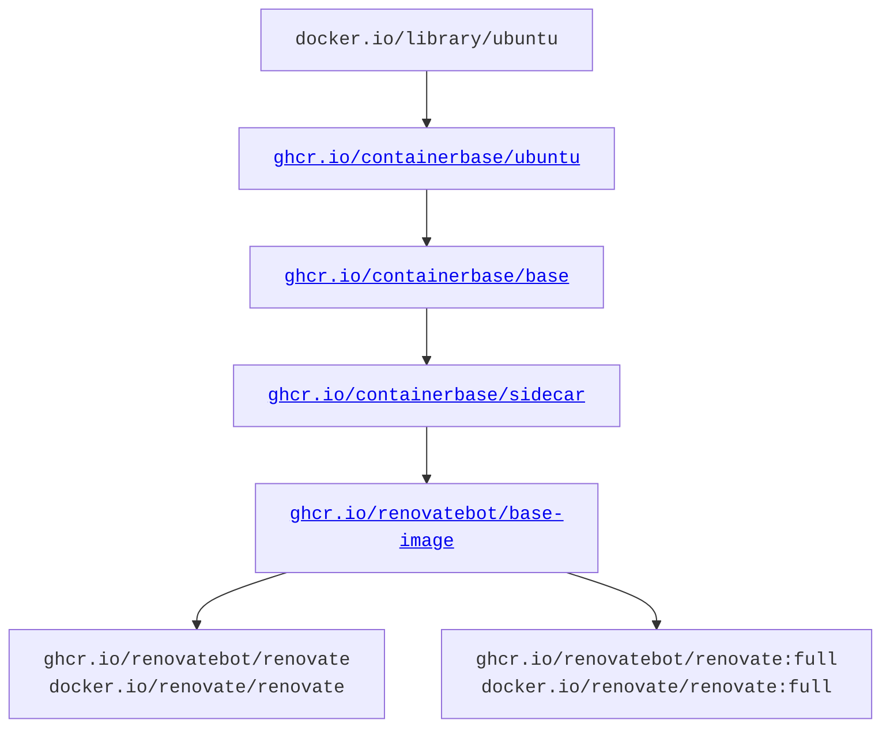

The Renovate CLI is distributed for use in a few ways, one of which is as a pre-built container.

As part of this build process, there are two key variants of this:

- "slim" image (default)
- "full" image

## Slim image (default)

Renovate's "slim" image is recommended as the minimal set of installed tools on a given container to be able to run Renovate.

It uses [`binarySource=install`](./self-hosted-configuration.md#binarysource) to dynamically install tools as they're needed.
This keeps the base container quite lightweight (hence "slim") but requires outbound network access at runtime.

It is possible to make the "slim" container even more lightweight by removing some of the tools and packages - for instance to reduce the attack surface, or reduce the size of the resulting image - but that is left as an exercise to the reader.

## Full image

Renovate's "full" image is recommended for users who prefer to have most tools pre-installed, and not require any outbound access at runtime.

It uses [`binarySource=global`](./self-hosted-configuration.md#binarysource) which only uses tools that are installed in the image.

When using the "full" image, there are some tools and packages installed in the container that you may not be using.
It is possible to remove these - for instance to reduce the attack surface, or reduce the size of the resulting image - but that is left as an exercise to the reader.

## Build process flow

Renovate leverages [Containerbase](https://github.com/containerbase), a project is maintained by the same maintainers as the Renovate CLI project itself, which provides base images and utilities for managing dependencies.

This leads to a release process that requires multiple different container releases to result in the Renovate container image being updated.

The full flow can be seen below:



## Tool support

### Adding new tools

If you, as a user, are looking to extend the tool support that Renovate has, for instance to install it via [`constraints`](./configuration-options.md#constraints), then you will need to [request a new tool](https://github.com/containerbase/base/issues/new?template=new-tool.yml).

<!-- prettier-ignore -->
!!! note
    In the future, there will be a [clearer guide](https://github.com/containerbase/base/issues/6570) for how to contribute tool support as a user.

This tool will have its support added in `containerbase/base`, to allow Containerbase's `install-tool` command-line tool to install the tool.

Once `install-tool` support is implemented, the update to `ghcr.io/containerbase/base` will need to bubble up to the Renovate "slim" and "full" images before the tool can be used.

### Changing default tools

If you, as a user, are looking to provide a tool installed by default (in the "slim" or "full" images), you will need to first make sure that the tool is supported (and if not, [add it](#adding-new-tools)).

To add it to the default images, the [`renovatebot/base-image` image](https://github.com/renovatebot/base-image) will need to be amended to add this tool.

<!-- prettier-ignore -->
!!! note
    Installed-by-default-tools will generally only be allowed for the "full" image.

## Building the Docker image locally

Renovate's Docker image can be built locally like so:

```sh
pnpm build
pnpm build:docker
# or to customize the build
env OWNER=jamietanna pnpm build:docker build --platform linux/amd64 --version 0.0.0-local
```
