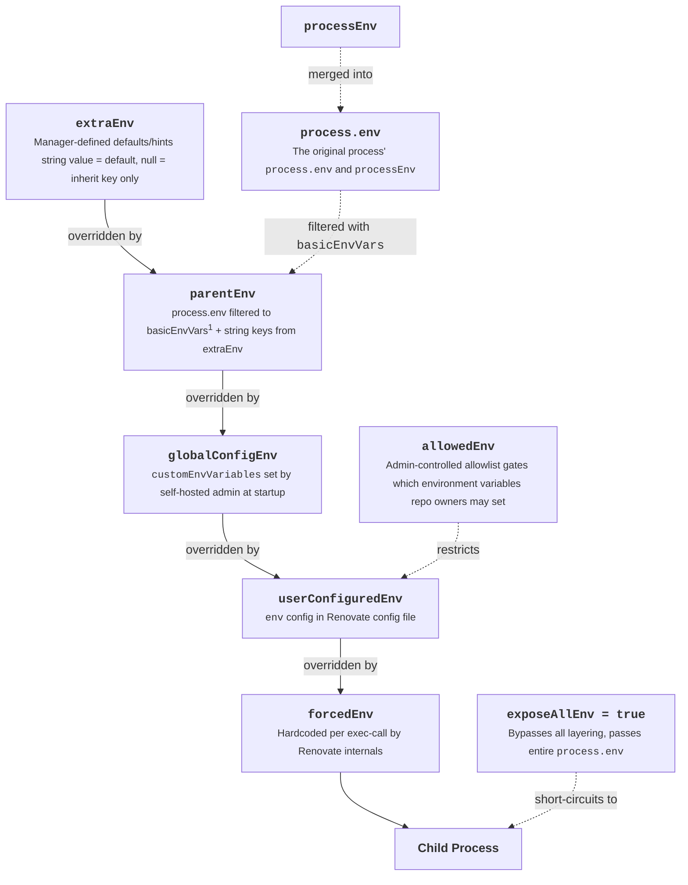

# Environment Variable Handling

## For Renovate

Renovate itself can be configured through a number of environment variables that correspond with [global self-hosted configuration options](./self-hosted-configuration.md), as well as some [repository configuration options](./configuration-options.md).
These environment variables have the prefix with `RENOVATE_`.

Renovate also has some ["experimental" variables that can be used with self-hosted deployments](./self-hosted-experimental.md).

It is also possible to use the following configuration options to control Renovate's environment variables:

- [`processEnv`](./self-hosted-configuration.md#processenv): in a configuration file (i.e. `config.js`), allows specifying the values that Renovate will receive in its environment

## With child processes

For security reasons, Renovate does not expose all environment variables to child processes.
Instead, Renovate will use an allowlist of environment variables which it passes to any processes it calls.

This is an intentional decision to protect against two key attack vectors:

- an ["insider attack"](./security-and-permissions.md#execution-of-code-insider-attack) from a user of your self-hosted Renovate deployment
- an ["outsider attack"](./security-and-permissions.md#execution-of-code-outsider-attack) from a malicious dependency

By limiting the environment variables provided to child processes, we can reduce the risk of a malicious actor from receiving access to potentially sensitive information, such as authentication tokens.

By default, Renovate will **always** pass the following environment variables to child processes:

<!-- Autogenerate basicEnvVars -->

!!! note
  Some managers pass additional environment variables where necessary.
   
  For example, Renovate will convert Host Rules to the respective environment variables when calling `npm`, `pnpm` and `yarn`, including setting `GIT_CONFIG_` environment variables.
   
  This is not currently documented in full - you will need to review Renovate's code to see the full list.

As a self-hosted administrator, you can make it possible to specify other environment variables that repository owners can set, using:

- [`allowedEnv`](./self-hosted-configuration.md#allowedenv): allows users to specify values for allowlisted environment variables in their repository configuration using [`env`](./configuration-options.md#env)
- [`customEnvVariables`](./self-hosted-configuration.md#customenvvariables): administrator-defined environment variables, injected directly into every child process. Users cannot override these in their repository configuration
- [`exposeAllEnv`](./self-hosted-configuration.md#exposeallenv): ⚠️ dangerously expose all environment variables from the Renovate process to all child processes
- [`extends: ["global:safeEnv"]`](./presets-global.md#globalsafeenv): a curated list of commonly used environment variables that should be safe to allow users to configure with [`env`](./configuration-options.md#env). This is used by Mend-hosted Renovate

With these option(s) configured, users will be able to set these environment variable(s) in their repository configuration using [`env`](./configuration-options.md#env), as well as [referencing them in any fields that support templating](#templating).

## Using environment variables for secrets

Where possible, Renovate will try and redact secrets in its log messages, and the log output from any child processes.
This relies on knowing whether the value is a secret for instance those configured through [`secrets`](./self-hosted-configuration.md#secrets) or in [`hostRules`](./configuration-options.md#hostrules).

If specifying an environment variable - through the above - with a value that isn't known to Renovate as a secret, this may lead to the secret being unknowingly exposed in the logs.

## Precedence

When determining which environment variables Renovate should pass to a child process, Renovate merges with the following precedence order:

1: the list of environment variables [noted above](#with-child-processes) that are always passed to child processes

## Templating

Allowlisted environment variables can be referenced in templates.
See [templates and environment variables](./templates.md#environment-variables) for more details.
