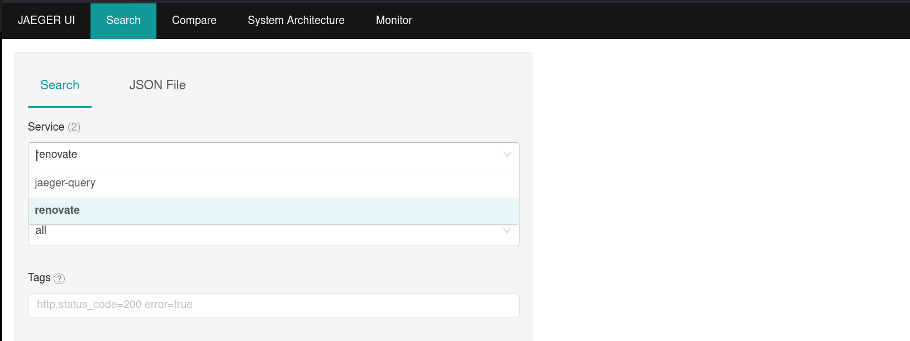
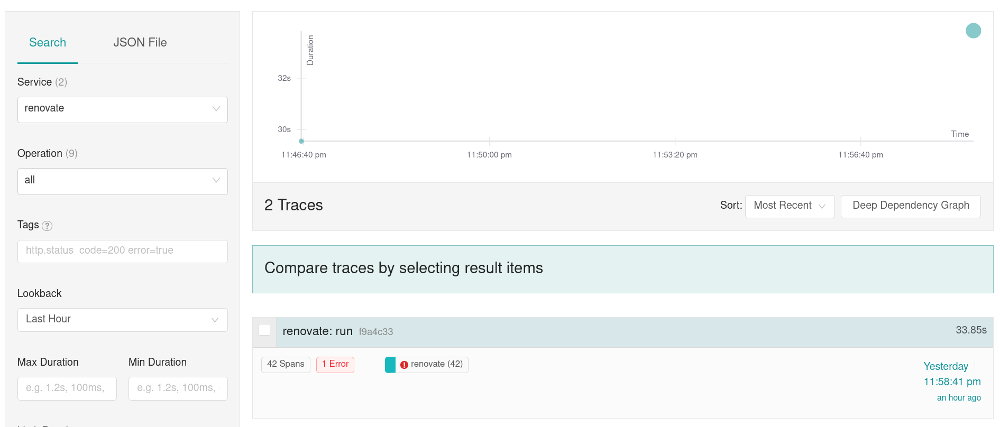
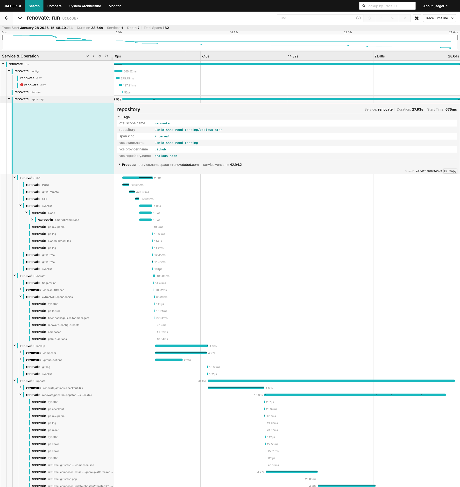

# OpenTelemetry

Requirements:

- docker-compose

## Prepare setup

Create a `docker-compose.yaml` and `otel-collector-config.yml` file as seen below in a folder.

`docker-compose.yaml`:

```yaml
version: '3'
services:
  # Jaeger
  jaeger:
    image: jaegertracing/all-in-one:1
    ports:
      - '16686:16686'
      - '14250'

  otel-collector:
    image: otel/opentelemetry-collector-contrib:0.52.0
    command: ['--config=/etc/otel-collector-config.yml']
    volumes:
      - ./otel-collector-config.yml:/etc/otel-collector-config.yml
    ports:
      - '1888:1888' # pprof extension
      - '13133:13133' # health_check extension
      - '55679:55679' # zpages extension
      - '4318:4318' # OTLP HTTP
      - '4317:4317' # OTLP GRPC
      - '9123:9123' # Prometheus exporter
    depends_on:
      - jaeger
```

`otel-collector-config.yml`:

```yaml
receivers:
  otlp:
    protocols:
      grpc:
      http:

exporters:
  jaeger:
    endpoint: jaeger:14250
    tls:
      insecure: true
  logging:
  prometheus:
    endpoint: '0.0.0.0:9123'

processors:
  batch:
  spanmetrics:
    metrics_exporter: prometheus
    latency_histogram_buckets: [10ms, 100ms, 250ms, 1s, 30s, 1m, 5m]
    dimensions:
      - name: http.method
      - name: http.status_code
      - name: http.host
    dimensions_cache_size: 1000
    aggregation_temporality: 'AGGREGATION_TEMPORALITY_CUMULATIVE'

extensions:
  health_check:
  pprof:
  zpages:

service:
  extensions: [pprof, zpages, health_check]
  pipelines:
    traces:
      receivers: [otlp]
      exporters: [jaeger, logging]
      processors: [spanmetrics, batch]

    metrics:
      receivers: [otlp]
      exporters: [prometheus]
```

Start setup using this command inside the folder containing the files created in the earlier steps:

```
docker-compose up
```

This command will start an [OpenTelemetry Collector](https://github.com/open-telemetry/opentelemetry-collector-contrib) and an instance of [Jaeger](https://www.jaegertracing.io/).

Jaeger will be now reachable under [http://localhost:16686](http://localhost:16686).

## Run Renovate with OpenTelemetry

To start Renovate with OpenTelemetry enabled run following command, after pointing to your `config.js` config file:

```
docker run \
  --rm \
  -e OTEL_EXPORTER_OTLP_ENDPOINT=http://localhost:4318 \
  -v "/path/to/your/config.js:/usr/src/app/config.js" \
  renovate/renovate:latest
```

You should now see `trace_id` and `span_id` fields in the logs.

```
 INFO: Repository finished (repository=org/example)
       "durationMs": 5574,
       "trace_id": "f9a4c33852333fc2a0fbdc163100c987",
       "span_id": "4ac1323eeaee
```

### Traces

Open now Jaeger under [http://localhost:16686](http://localhost:16686).

You should now be able to pick `renovate` under in the field `service` field.



Select `Find Traces` to search for all Renovate traces and then select one of the found traces to open the trace view.



You should be able to see now the full trace view which shows each HTTP request and internal spans.



### Metrics

Additional to the received traces some metrics are calculated.
This is achieved using the [spanmetricsprocessor](https://github.com/open-telemetry/opentelemetry-collector-contrib/tree/main/processor/spanmetricsprocessor).
The previous implemented setup will produce following metrics, which are exposed under [http://localhost:9123/metrics](http://localhost:9123/metrics):

```
# HELP calls_total
# TYPE calls_total counter

### Example of internal spans
calls_total{operation="renovate repository",service_name="renovate",span_kind="SPAN_KIND_INTERNAL",status_code="STATUS_CODE_UNSET"} 3
calls_total{operation="run",service_name="renovate",span_kind="SPAN_KIND_INTERNAL",status_code="STATUS_CODE_UNSET"} 1
### Example of http calls from Renovate to external services
calls_total{http_host="api.github.com:443",http_method="POST",http_status_code="200",operation="HTTPS POST",service_name="renovate",span_kind="SPAN_KIND_CLIENT",status_code="STATUS_CODE_UNSET"} 9

...

# HELP latency
# TYPE latency histogram
### Example of internal spans
latency_bucket{operation="renovate repository",service_name="renovate",span_kind="SPAN_KIND_INTERNAL",status_code="STATUS_CODE_UNSET",le="0.1"} 0
...
latency_bucket{operation="renovate repository",service_name="renovate",span_kind="SPAN_KIND_INTERNAL",status_code="STATUS_CODE_UNSET",le="9.223372036854775e+12"} 3
latency_bucket{operation="renovate repository",service_name="renovate",span_kind="SPAN_KIND_INTERNAL",status_code="STATUS_CODE_UNSET",le="+Inf"} 3
latency_sum{operation="renovate repository",service_name="renovate",span_kind="SPAN_KIND_INTERNAL",status_code="STATUS_CODE_UNSET"} 30947.4689
latency_count{operation="renovate repository",service_name="renovate",span_kind="SPAN_KIND_INTERNAL",status_code="STATUS_CODE_UNSET"} 3

...

### Example of http calls from Renovate to external services
latency_bucket{http_host="api.github.com:443",http_method="POST",http_status_code="200",operation="HTTPS POST",service_name="renovate",span_kind="SPAN_KIND_CLIENT",status_code="STATUS_CODE_UNSET",le="0.1"} 0
...
latency_bucket{http_host="api.github.com:443",http_method="POST",http_status_code="200",operation="HTTPS POST",service_name="renovate",span_kind="SPAN_KIND_CLIENT",status_code="STATUS_CODE_UNSET",le="250"} 3
latency_bucket{http_host="api.github.com:443",http_method="POST",http_status_code="200",operation="HTTPS POST",service_name="renovate",span_kind="SPAN_KIND_CLIENT",status_code="STATUS_CODE_UNSET",le="9.223372036854775e+12"} 9
latency_bucket{http_host="api.github.com:443",http_method="POST",http_status_code="200",operation="HTTPS POST",service_name="renovate",span_kind="SPAN_KIND_CLIENT",status_code="STATUS_CODE_UNSET",le="+Inf"} 9
latency_sum{http_host="api.github.com:443",http_method="POST",http_status_code="200",operation="HTTPS POST",service_name="renovate",span_kind="SPAN_KIND_CLIENT",status_code="STATUS_CODE_UNSET"} 2306.1385999999998
latency_count{http_host="api.github.com:443",http_method="POST",http_status_code="200",operation="HTTPS POST",service_name="renovate",span_kind="SPAN_KIND_CLIENT",status_code="STATUS_CODE_UNSET"} 9
```

The [spanmetricsprocessor](https://github.com/open-telemetry/opentelemetry-collector-contrib/tree/main/processor/spanmetricsprocessor) creates two sets of metrics.

#### Calls metric

At first there are the `calls_total` metrics which display how often specific trace spans have been observed.

For example:
`calls_total{operation="renovate repository",service_name="renovate",span_kind="SPAN_KIND_INTERNAL",status_code="STATUS_CODE_UNSET"} 3` signals that 3 repositories have been renovated.
`calls_total{operation="run",service_name="renovate",span_kind="SPAN_KIND_INTERNAL",status_code="STATUS_CODE_UNSET"} 1` represents how often Renovate has been run.

If we combine this using the PrometheusQueryLanguage ( PromQL ), we can calculate the average count of repositories each Renovate run handles.

```
calls_total{operation="renovate repository",service_name="renovate"} / calls_total{operation="run",service_name="renovate"}
```

This metrics is also for spans generated by http calls:

```yaml
calls_total{http_host="registry.terraform.io:443",http_method="GET",http_status_code="200",operation="HTTPS GET",service_name="renovate",span_kind="SPAN_KIND_CLIENT",status_code="STATUS_CODE_UNSET"} 5
```

#### Latency buckets

The second class of metrics exposed are the latency focused latency buckets which allow to create [heatmaps](https://grafana.com/docs/grafana/latest/basics/intro-histograms/#heatmaps).
A request is added to a backed if the latency is bigger than the bucket value (`le`). `request_duration => le`

As an example if we receive a request which need `1.533s` to complete get following metrics:

```
latency_bucket{http_host="api.github.com:443",le="0.1"} 0
latency_bucket{http_host="api.github.com:443",le="1"} 0
latency_bucket{http_host="api.github.com:443",le="2"} 1
latency_bucket{http_host="api.github.com:443",le="6"} 1
latency_bucket{http_host="api.github.com:443",le="10"} 1
latency_bucket{http_host="api.github.com:443",le="100"} 1
latency_bucket{http_host="api.github.com:443",le="250"} 1
latency_bucket{http_host="api.github.com:443",le="9.223372036854775e+12"} 1
latency_bucket{http_host="api.github.com:443",le="+Inf"} 1
latency_sum{http_host="api.github.com:443"} 1.533
latency_count{http_host="api.github.com:443"} 1
```

Now we have another request which this time takes 10s to complete:

```
latency_bucket{http_host="api.github.com:443",le="0.1"} 0
latency_bucket{http_host="api.github.com:443",le="1"} 0
latency_bucket{http_host="api.github.com:443",le="2"} 1
latency_bucket{http_host="api.github.com:443",le="6"} 1
latency_bucket{http_host="api.github.com:443",le="10"} 2
latency_bucket{http_host="api.github.com:443",le="100"} 2
latency_bucket{http_host="api.github.com:443",le="250"} 2
latency_bucket{http_host="api.github.com:443",le="9.223372036854775e+12"} 2
latency_bucket{http_host="api.github.com:443",le="+Inf"} 2
latency_sum{http_host="api.github.com:443"} 11.533
latency_count{http_host="api.github.com:443"} 2
```

More about the functionality can be found on the Prometheus page for [metric types](https://prometheus.io/docs/concepts/metric_types/#histogram).
