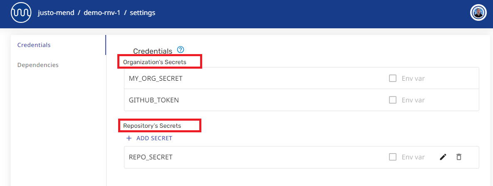

# Using Secrets with Mend Cloud Apps

The Mend-hosted cloud apps - Renovate App on GitHub, Mend App on Bitbucket - have deprecated the use of encrypted secrets in Renovate config files stored in the repo.
Instead, secrets for the cloud apps must be stored in the app settings using the web UI available at [developer.mend.io](http://developer.mend.io).

## How to use secrets in the Mend Hosted Cloud Apps

To use secrets in the Mend Cloud apps:

1. Add the secret in the **Credentials** section of the Org or Repo settings in the web UI at [http://developer.mend.io](http://developer.mend.io).

   

2. Reference the secret from Renovate config files inside the repo.

   ```json
   {
     "hostRules": [
       {
         "matchHost": "github.com",
         "token": "{{ secrets.MY-ORG-SECRET-1 }}"
       }
     ]
   }
   ```

## Org secrets versus Repo secrets

When adding a secret in the web UI, check whether you are adding **Organization secrets** or **Repository secrets**.

- Org-level secrets will be inherited by all repos in the org.
- Repo-level secrets can be referenced by only the specific repo.



This image shows credentials from the Repo settings page. It shows inherited Organisation Secrets, plus the specific Repository Secrets.
Only the Repo settings can be edited here. Org settings must be edited in the Org settings page.

- **To access Org-level secrets**, press the `Settings` button on the Org page.<br/>
  _Tip: You know you are on the Org page if you see the **Installed Repositories** table._


- **To access Repo-level secrets**, press the `Settings` button on the Repo page.<br/>
  _Tip: You know you are on a Repo page if you see the **Recent jobs** table._


## Related links

- [Migrating encrypted secrets from Repo Config to App Settings](migrating-secrets.md)
