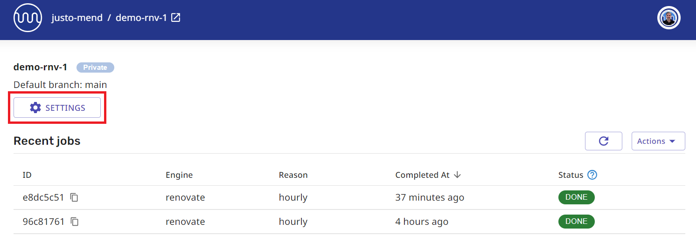
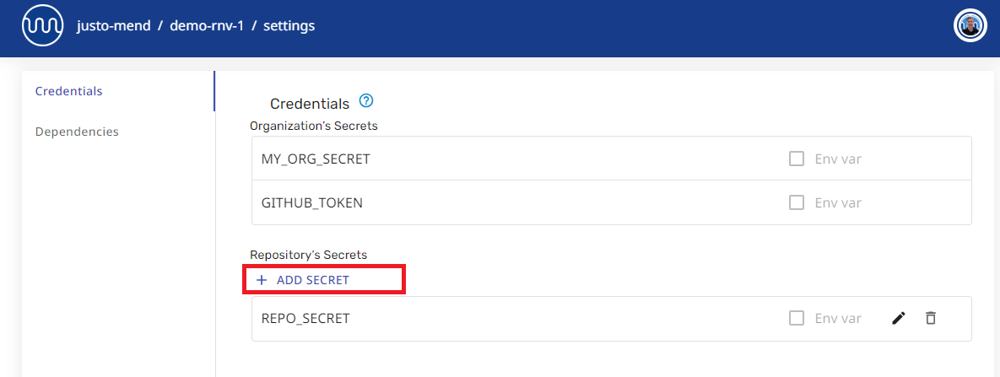

# Using Secrets with Mend Cloud Apps

The Mend-hosted cloud apps - Renovate App on GitHub, Mend App on Bitbucket - have deprecated the use of encrypted secrets in Renovate config files stored in the repo.
Instead, secrets for the cloud apps must be stored in the app settings using the web UI available at [developer.mend.io](http://developer.mend.io).

## How to use secrets in the Mend Hosted Cloud Apps

To use secrets in the Mend Cloud apps:

1. Add the secret in the **Credentials** section of the [Developer Portal](http://developer.mend.io) Org or Repo settings.


2. Reference the secret from Renovate config files inside the repo.

```json
{
  "hostRules": [
    {
      "matchHost": "github.com",
      "token": "{{ secrets.MY-ORG-SECRET-1 }}"
    }
  ]
}
```

## Org secrets versus Repo secrets

When adding a secret in the Developer Portal UI, check whether you are adding **Organization secrets** or **Repository secrets**.

- An org-level secret can be referenced by any repo in the org.
- A repo-level secret can be referenced by only the specific repo.


This image shows credentials from the Repo settings page. It shows inherited Organisation Secrets, plus the specific Repository Secrets.
Only the Repo settings can be edited here. Org settings must be edited in the Org settings page.

- **To access Org-level secrets**, press the `Settings` button on the Org page.<br/>
  _Tip: You know you are on the Org page if you see the **Installed Repositories** table._


- **To access Repo-level secrets**, press the `Settings` button on the Repo page.<br/>
  _Tip: You know you are on a Repo page if you see the **Recent jobs** table._



# Migrating Secrets from Repo Config to App Settings

Storing of encrypted secrets in the repo is not supported starting from 01-Sep-2024 for Mend Renovate Cloud apps.
Previously, secrets used in the app would be encrypted using the [Renovate encryption tool](https://app.renovatebot.com/encrypt) and stored in Renovate config files.
Now all secrets must be stored in the app settings on the cloud.
They can be referenced from the Renovate config files inside the repo.

**Example - Deprecated version**: Encrypted secrets in Renovate config

```json
{
  "hostRules": [
    {
      "matchHost": "github.com",
      "encrypted": {
        "token": "drsMDVf6M2hTZCN......+gQm/0Rpw"
      }
    }
  ]
}
```

Encrypted secrets must be migrated to App settings via the Developer Portal UI.<br/>
Secrets can be referenced in the repo using `{{ secrets.SECRET_NAME }}` notation.

**Example - Supported version**: Reference App secrets from the Renovate config

```json
{
  "hostRules": [
    {
      "matchHost": "github.com",
      "token": "{{ secrets.GITHUB_COM_TOKEN }}"
    }
  ]
}
```

## Moving encrypted secrets

Use of encrypted secrets in Renovate config files is deprecated with the Mend cloud apps. All Renovate encrypted secrets that exist in your repo today must be moved to the App settings via the Developer Portal.

### If you know the original secret (unencrypted / plain text):

#### To migrate plain text secrets:

1. Go to the settings for the correct Org or Repo in the [Developer Portal](http://developer.mend.io) web UI.

2. In the **Credentials** page, press `ADD SECRET` to add the plain text secret.



3. Provide a value for `Secret name`, put the secret in the `Secret Value` field, and press `SAVE`.


> [!NOTE]
>
> The value of a secret can never be retrieved, be it can be updated. If needed, secrets can be deleted and recreated.

4. Look for a confirmation dialog showing **“Successfully stored secret”**.


### If you DO NOT KNOW the original unencrypted secret:

You can migrate the encrypted secret directly to the App settings in the Developer Portal.
The App will decrypt it to its original value and store it re-encrypted with a new key.
The unencrypted secret is never shown, never logged and never stored.

#### To migrate encrypted secrets:

1. Copy the encrypted secret from the Renovate config file.

2. Go to the settings for the correct Org or Repo in the [Developer Portal](http://developer.mend.io) web UI.

3. In the **Credentials** page, press `ADD SECRET` to add the encrypted secret.

4. Provide a value for `Secret name`, put the encrypted secret in the `Secret Value` field, and press `SAVE`.

> [!NOTE]
>
> When migrating an existing secret from a repo, be sure to add the secret to the same Org or Repo for which the secret was generated.
>
> - A secret generated for a specific repo cannot be added to a different repo.
> - A secret generated for a specific repo cannot be added to the Org settings. It can only be added into Repo settings for the matching repo.
> - A secret generated without a specific repo can be added into Org or Repo settings in the matching org.

The settings UI will provide helpful information if you try to add the secret in the wrong place.


5. Look for the confirmation box to say **“Successfully migrated secret”** to confirm that the secret was correctly decrypted and stored in the correct Org or Repo.


> [!IMPORTANT]
>
> If the confirmation box does not say “Successfully migrated secret”, and instead says “Successfully stored secret” then the secret was not detected as a Renovate encrypted secret and the value was treated as plain text.
> If you were expecting to import a secret originally encrypted by Renovate:
>
> - Make sure you are using the secret in the correct Org and/or Repo
> - Check that you copied the encrypted secret correctly, and try again
