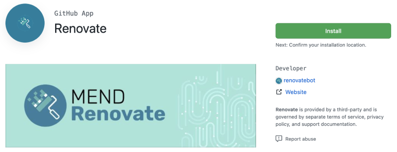
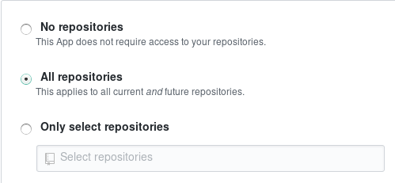
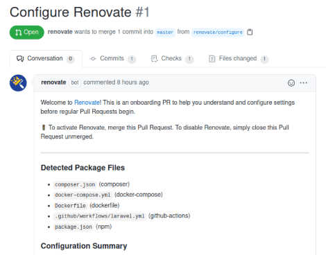

# Installing and onboarding Renovate into repositories

## Repository installation

Renovate administrators can configure Renovate to either "autodiscover" installed repositories, or configure a fixed list of repository names to operate on.

If the administrator has configured a fixed list of repositories then the only way to "install" Renovate on an additional repository is for it to be manually added for the next run or restart.

Otherwise, the process for adding new repositories to a Renovate installation can vary:

- Most commonly, you run Renovate as a dedicated "bot user" with global config option `autodiscover` set to `true`, meaning that it will run on every repository which it's been granted access to
- If using a GitHub App (including Mend Renovate on `github.com`) then you can install the app into a user or organization account and select either "All repositories", or "Select repositories" and pick them manually

### Hosted GitHub.com App

Installing/enabling Mend's Renovate GitHub App is simple.

First, navigate to [https://github.com/apps/renovate](https://github.com/apps/renovate) and click the Install button:

{ loading=lazy }

The only choice you need to make is whether to run Renovate on all repositories or on selected repositories:

{ loading=lazy }

Renovate will ignore any repositories that don't have known package files, as well as any forks, so you can enable Renovate for all your repositories with no problems.
That said, most people run Renovate on selected repositories.
Unfortunately GitHub doesn't offer a "select all except X, Y, Z" option, so you must select each repository where you want Renovate to run.

Once you're done selecting repositories for Renovate to run on, click the green Install button at the bottom of the page and Renovate will be enabled for those repositories and start the onboarding process.

<!-- prettier-ignore -->
!!! note
    If you are using the Mend Renovate App then it has a custom behavior for forked repositories.
    If you choose "All repositories" when installing then forked repositories will be skipped by default, while if you choose "Select repositories" then they will be processed by Renovate even if they're a fork.

### Hosted GitLab.com App

Unfortunately Mend's hosted GitLab app needed to be taken offline indefinitely until a viable security model for bots on GitLab.com is available.
For more details on GitLab security for bots, please see the [GitLab Bot Security](../gitlab-bot-security.md) doc.

### Self-hosting on Windows

We recommend you set [`core.autocrlf = input`](https://git-scm.com/docs/gitattributes#_text) in your Git config.
You can do this by running this Git command:

```bash
git config --global core.autocrlf input
```

This prevents the carriage return `\r\n` which may confuse Renovate bot.
You can also set the line endings in your repository by adding `* text=auto eol=lf` to your `.gitattributes` file.

## Repository onboarding

Once you have enabled Renovate on a repository, you will get a "Configure Renovate" Pull Request looking something like this:

{ loading=lazy }

### No risk onboarding

Conveniently, Renovate will not make any changes to your repository or raise any further Pull Requests until after you _merge_ the onboarding Pull Request.
If there is anything about the Pull Request that you don't like or understand, take your time to read the [documentation](https://docs.renovatebot.com) or ask questions on the [discussions forum on GitHub](https://github.com/renovatebot/renovate/discussions) and merge the PR only once you're satisfied with the result.

You can edit your Renovate configuration **within the `renovate/configure` branch** and Renovate will keep updating the description in the PR to match, so you can work on the config until you're satisfied with the results.

### Check for warnings

If you have any Warnings or Errors listed, see if you need or want to make any changes to fix them.
Warnings and errors should be fixed on the base branch (e.g. `main`) so that Renovate can recreate its Configure Renovate PR on its next cycle.

### Configuration location

The "Configure Renovate" PR will include a `renovate.json` file in the root directory, with suggested default settings.
If you don't want a `renovate.json` file in your repository you can use one of the following files instead:

- `renovate.json5`
- `.github/renovate.json`
- `.github/renovate.json5`
- `.gitlab/renovate.json`
- `.gitlab/renovate.json5`
- `.renovaterc`
- `.renovaterc.json`
- `package.json` (deprecated)

#### package.json

<!-- prettier-ignore -->
!!! warning
    This approach has been deprecated and will be removed in a future release.

You can add the same settings to a `"renovate"` section in your `package.json` file instead.
The `package.json` file must be located at the root of your repository.
This is handy if you are already using a `package.json` file anyway, e.g. when you're working on a JavaScript project.
The configuration in your `package.json` will apply to the whole project (this includes other, nested `package.json` files).

### Customised defaults

Renovate provides a `renovate.json` file, with default settings that will work for most cases.
Sometimes Renovate detects that an override to these defaults is needed, and will add this override automatically, such as:

- Automatically enabling Angular-style semantic commits if your repository uses them
- Determining whether to use dependency range pinning depending on the detected project type (app vs library)

### Common overrides

Please check the docs on this website for an exhaustive Configuration Reference.
To help you get started, here are some of the most commonly changed (overridden) configuration settings:

- **rangeStrategy**: By default (with zero config) it's `"replace"` but the `"config:base"` preset overrides it to `"auto"`. If you don't want to pin dependency versions and retain ranges, add the `":preserveSemverRanges"` preset to the `extends` array
- **labels**: Labels to assign to Pull Requests
- **assignees**: GitHub user(s) to assign the Pull Requests to

Renovate will update your PR description each time it finds changes.

### Merge

Once you're done checking and configuring in your Configure Renovate PR, it's time to merge it to enable the real Pull Requests to begin.

## Repository re-configuration

There will be times when you need to change your Renovate config.
There are two recommended approaches:

- Reconfigure via PR
- Nuke the config and re-onboard

### Reconfigure via PR

If you want to make config edits directly, follow these steps:

1. Create a new Git branch to work on
1. Install or update the `renovate` package globally (`npm i -g renovate` or `yarn global add renovate`) to get the `renovate-config-validator` program
1. Edit your Renovate configuration file
1. Validate your config by running `renovate-config-validator`
1. If the improved config passes the validation, merge the branch into your mainline branch

The validator program checks files passed as CLI arguments.
If no argument is given, all [default locations](../configuration-options.md) (if files exist) and the `RENOVATE_CONFIG_FILE` environment variable are checked.

You can configure a [pre-commit](https://pre-commit.com) hook to validate your configuration automatically.
Please check out the [`renovatebot/pre-commit-hooks` repository](https://github.com/renovatebot/pre-commit-hooks) for more information.

### Nuke config and re-onboard

Perhaps you really liked the interactive onboarding PR and want to use it again.
You can follow the steps below to nuke the config and get a new PR.
Any existing Renovate PRs will be closed after you've completed these steps.

1. Find your original `Configure Renovate` PR
1. Rename the original PR to something else, e.g. `Configure Renovate - old`
1. Remove the current Renovate configuration file (e.g. `renovate.json`) from your mainline branch

Following these steps will trick Renovate into thinking that your repository was _never_ onboarded, and will trigger a new "Configure Renovate" PR.
If you're using the hosted Mend Renovate App and you don't get a new onboarding PR within a few hours, then please create a Discussions post to request staff trigger it manually.
