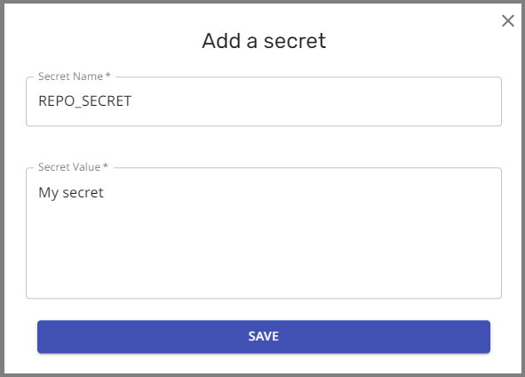

# Migrating Secrets from Repo Config to App Settings

Storing of encrypted secrets in the repo is not supported starting from 01-Oct-2024 for Mend Renovate Cloud apps.
Previously, secrets used in the App would be encrypted using the [Renovate encryption tool](https://app.renovatebot.com/encrypt) and stored in Renovate config files.
Now all secrets must be stored in the App settings on the cloud.
They can be referenced from the Renovate config files inside the repo using `{{ secrets.SECRET_NAME }}` notation.

**Example - Deprecated version**: Encrypted secrets included in Renovate config

```json
{
  "hostRules": [
    {
      "matchHost": "github.com",
      "encrypted": {
        "token": "drsMDVf6M2hTZCN......+gQm/0Rpw"
      }
    }
  ]
}
```

**Example - Supported version**: Reference App secrets from the Renovate config

```json
{
  "hostRules": [
    {
      "matchHost": "github.com",
      "token": "{{ secrets.GITHUB_COM_TOKEN }}"
    }
  ]
}
```

> [!NOTE]
>
> When migrating encrypted secrets, we recommend copying over the existing secrets in their _**encrypted form**_. The UI will handle the decryption and store the value securely.
> Avoid trying to change the secret during migration, as this will introduce an additional potential point of failure.

## To migrate encrypted secrets using the encrypted value

1. Copy the encrypted secret from the Renovate config file.

2. Go to the settings for the correct Org or Repo in the web UI at [http://developer.mend.io](http://developer.mend.io).

3. In the **Credentials** page, press `ADD SECRET` to add the encrypted secret.

4. Provide a value for `Secret name`, put the encrypted secret in the `Secret Value` field, and press `SAVE`.

   > [!NOTE]
   >
   > When migrating an existing secret from a repo, be sure to add the secret to the same Org or Repo for which the secret was generated.
   >
   > - A secret generated for a specific repo cannot be added to a different repo.
   >   - A secret generated for a specific repo cannot be added to the Org settings. It can only be added into Repo settings for the matching repo.
   >   - A secret generated without a specific repo can be added into Org or Repo settings in the matching org.

   The settings UI will provide helpful information if you try to add the secret in the wrong place.

   

5. Look for the confirmation box to say **“Successfully migrated secret”** to confirm that the secret was correctly decrypted and stored in the correct Org or Repo.


> [!IMPORTANT]
>
> If the confirmation box does not say **“Successfully migrated secret”**, and instead says **“Successfully stored secret”** then the secret was not detected as a Renovate encrypted secret and the value was treated as plain text.
> If you were expecting to import a secret originally encrypted by Renovate:
>
> - Make sure you are using the secret in the correct Org and/or Repo.
> - Check that you copied the encrypted secret correctly, and try again.

## To migrate encrypted secrets using the plain text value

1. Go to the settings for the correct Org or Repo in the web UI at [http://developer.mend.io](http://developer.mend.io).

2. In the **Credentials** page, press `ADD SECRET` to add the plain text secret.

   

3. Provide a value for `Secret name`, put the secret in the `Secret Value` field, and press `SAVE`.

   

4. Look for a confirmation dialog showing **“Successfully stored secret”**.

   

## Related links

- [Using Secrets with Mend Cloud Apps](app-secrets.md)
