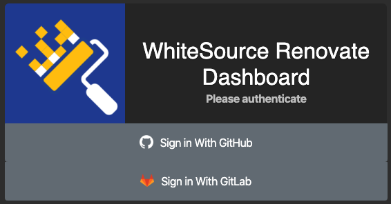
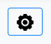
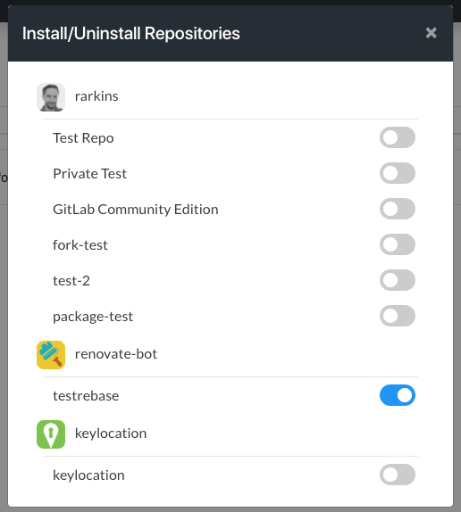
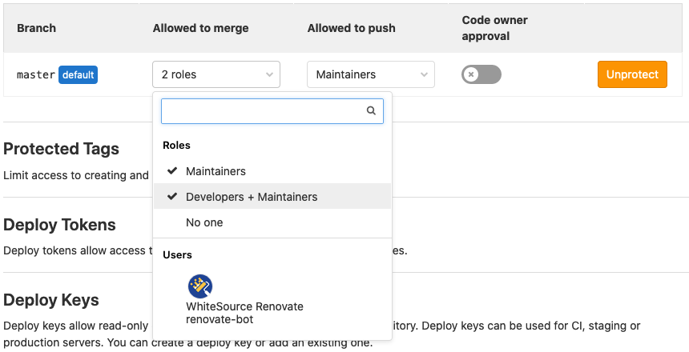
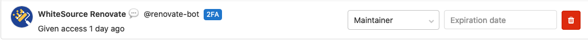
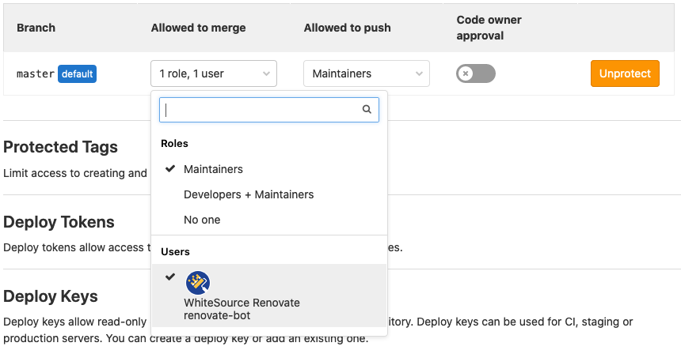
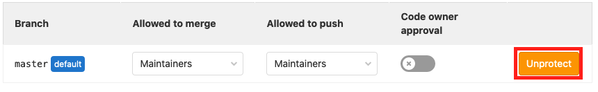

# GitLab App Installation

### Overview

WhiteSource Renovate runs as the user [@renovate-bot](https://gitlab.com/renovate-bot) on [gitlab.com](https://gitlab.com).
To enable the hosted WhiteSource Renovate App on your GitLab.com project, you can do any of the following:

- Add [@renovate-bot](https://gitlab.com/renovate-bot) as a Developer directly to each project, or
- Add [@renovate-bot](https://gitlab.com/renovate-bot) to a team that has Developer access to the project
- Install using the WhiteSource Renovate Dashboard's UI

### Dashboard

First, sign into the [Dashboard](https://app.renovatebot.com/dashboard) using GitLab OAuth.



If it is your first time signing in, you will be asked to submit WhiteSource's registration form after logging in.

The Dashboard sidebar will load a list of any already-installed repositories that you have access to, if there are any.

Now click the "Settings" icon  at the top of the side bar and it will soon load a list of all GitLab.com repositories that you have admin rights to.



On this screen, toggle the switch to install Renovate into a repo. Doing so will:

- Add [@renovate-bot](https://gitlab.com/renovate-bot) as a Developer to the project
- Add a webhook to the project to send events to the Renovate webhook handler

### Webhooks

One of the best aspects of the hosted Renovate App compared to the CLI version is the responsiveness gained from supporting webhooks, such as:

- Detecting commits to master and checking for any MR conflicts that need to be rebased
- Allowing manual rebase requests from any MR

If you have added [@renovate-bot](https://gitlab.com/renovate-bot) to a repository or team manually rather than through the Dashboard UI then you _won't_ yet have a webhook.
To add webhooks for all missing projects, simply log into the Dashboard and load the Install/Uninstall screen using the instructions above.
Whenever that screen is loaded, the Dashboard client will check every installed project for webhooks and install Renovate's webhook if necessary.

### Pricing

WhiteSource Renovate is free for both public and private repositories, so no payment is necessary.

### Configuring a Token for GitHub.com-hosted Release Notes

Renovate needs a Personal Access Token configured in order to be able to fetch release notes from github.com repositories.

Although open source repositories are public, GitHub's API applies strict rate limiting to unauthenticated requests, so Renovate will not attempt to fetch unless it can detect a token.
To fetch without a token would risk getting requests denied, which could in turn result in confusing inconsistencies in Pull or Merge Requests, including bodies which flip flop between release notes and none.

#### Generate a Personal Access Token

Any read-only, public-only Personal Access Token for github.com will work.

While logged in, go to [https://github.com/settings/tokens/new](https://github.com/settings/tokens/new).
Add a note like "renovate release notes" and then generate the token - no further permissions are required.

#### Configuring the Token

Visit [https://renovatebot.com/encrypt](https://renovatebot.com/encrypt), paste your token into "Raw value", and then click "Encrypt".
Configure the resulting value into your renovate config or preset like this:

```json
{
  "hostRules": [
    {
      "domainName": "github.com",
      "encrypted": {
        "token": "zmWY1ucZFj8wS0ap5ahQluho8aVJBVfyM9LTJ5fCV3Cl6Ys9ml+ZnsQMABKPPGbDoXhhy/REokuho8aVJBVfyM9LTJ5fCV3Cl6Ys9ml+ZnsQMABKPPGbDoXhhy/REokQRS7sFhwTPwpRC9+DyWUgYYO28/kCmw+/8wNupIY1C+rSVSGc4PxV7y2YYd/Ef1jTEVJR+LUrGYuzpJxPuo6ai2wbUCFtx0Z43lH24aDql9btupxYAWNP3RVR6bAp6rA9YGESeD6YTDVvn5czGpvUnIOryxEkigoDcEYmIXFm9Y6F4DLXpLOQ=="
      }
    }
  ]
}
```

Alternatively, the `:githubComToken(<token>)` preset achieves the same:

```json
{
  "extends": [
    ":githubComToken(zmWY1ucZFj8wS0ap5ahQluho8aVJBVfyM9LTJ5fCV3Cl6Ys9ml+ZnsQMABKPPGbDoXhhy/REokuho8aVJBVfyM9LTJ5fCV3Cl6Ys9ml+ZnsQMABKPPGbDoXhhy/REokQRS7sFhwTPwpRC9+DyWUgYYO28/kCmw+/8wNupIY1C+rSVSGc4PxV7y2YYd/Ef1jTEVJR+LUrGYuzpJxPuo6ai2wbUCFtx0Z43lH24aDql9btupxYAWNP3RVR6bAp6rA9YGESeD6YTDVvn5czGpvUnIOryxEkigoDcEYmIXFm9Y6F4DLXpLOQ==)"
  ]
}
```

### Details and Known Limitations

##### Credentials storage

The Renovate App does not need to store user OAuth2 tokens - all regular access to gitlab.com is done using the token of [@renovate-bot](https://gitlab.com/renovate-bot).
User tokens are passed with API calls to Renovate's backend to verify identity but never logged or cached.

##### Installing for all projects

Unlike on GitHub, it is not possible to have the option to install Renovate on "all repositories now and in the future".
To do this would require Renovate to store the user's token and this is not something we want to do.

##### Detecting new projects

Currently there is no detection mechanism in the backend scheduler to determine when Renovate has been added to a new project, so the onboarding MR won't appear instantly.
Instead, the new project should be picked up during hourly scheduled runs.

##### Auto merging pull requests

If you have auto merging enabled in your config, Renovate needs permission to merge a branch into master.

There's four ways to make it work:

- Allow all developers to merge into master branch
  

- Change renovate-bot member permission from developer to **maintainer**
  

- Allow **renovate-bot** to merge into master
  

- Change master branch from protected branch to **unprotected** branch
  
