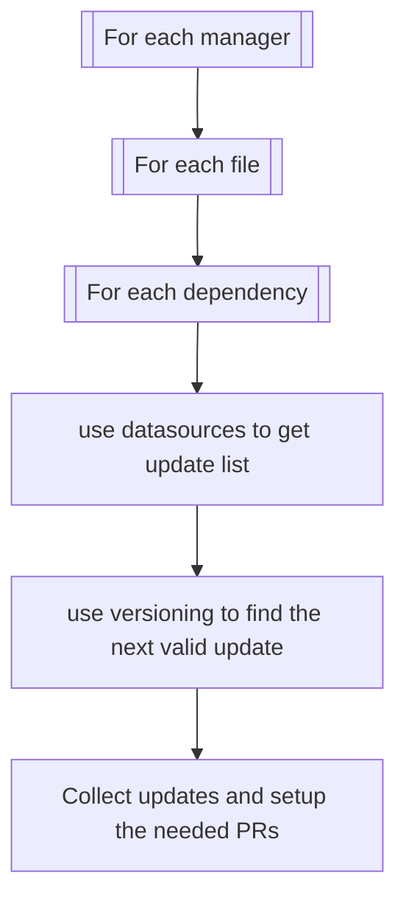

# Introduction

Renovate works by searching for all the dependencies in your project and then look for updates for each.

To be compatible with the variety of dependency-naming and versioning conventions, Renovate has defined modules for each known convention, and you can define your own too.

## Modules

The three modules are: [manager](../modules/manager/index.md), [datasource](../modules/datasource/index.md) and [versioning](../modules/versioning.md).

They are used sequentially:

1. the manager module looks for files based on their name and extract dependencies from them, each dependency has a datasource
2. the datasource module looks for the existing versions of the dependency
3. the versioning module search for a valid version regarding the dependency's version

For example:

1. the `gitlabci` manager finds a dependency named `python:3.10-alpine` of datasource `docker`
2. the `docker` datasource looks for versions and finds `[python:3.9,python:3.9-alpine,python:3.10,python:3.10-alpine,python:3.11,python:3.11-alpine]`
3. the `docker` versioning takes `python:3.11-alpine` as it is compatible with `python:3.10-alpine`

