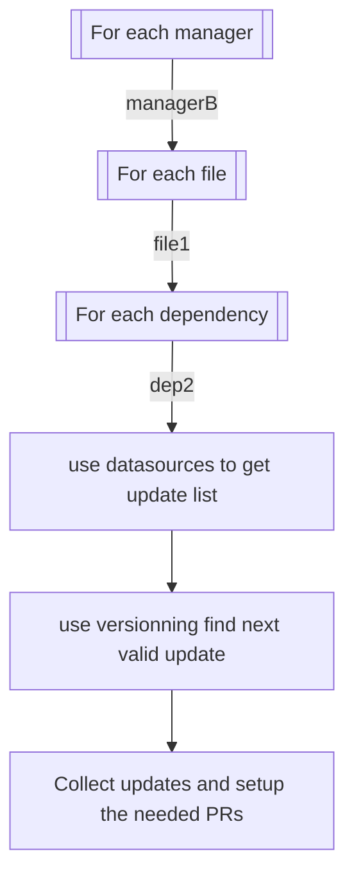

# Introduction

Renovate works by searching for all the dependencies in your projetc and then for each look for updates.

To be compatible with the variety of dependency-naming and versionning conventions, renovate has defined modules that
holds parts of a global workflow.

## Modules

The three modules are: manager, datasource and versionning.

They are used sequentially:

1. the manager module looks for files based on their name and extract dependencies from them, each dependency has a
   datasource
2. the datasource module looks for the existing versions of the dependency
3. the versionning module search for a valid version regarding the dependency's version

Example

1. the `gitlabci` manager find a dependency named `python:3.10-alpine` of datasource `docker`
2. the `docker` datasource looks for versions and
   find `[python:3.9,python:3.9-alpine,python:3.10,python:3.10-alpine,python:3.11,python:3.11-alpine]`
3. the `docker` versionning takes `python:3.11-alpine` as it is compatible with `python:3.10-alpine`

