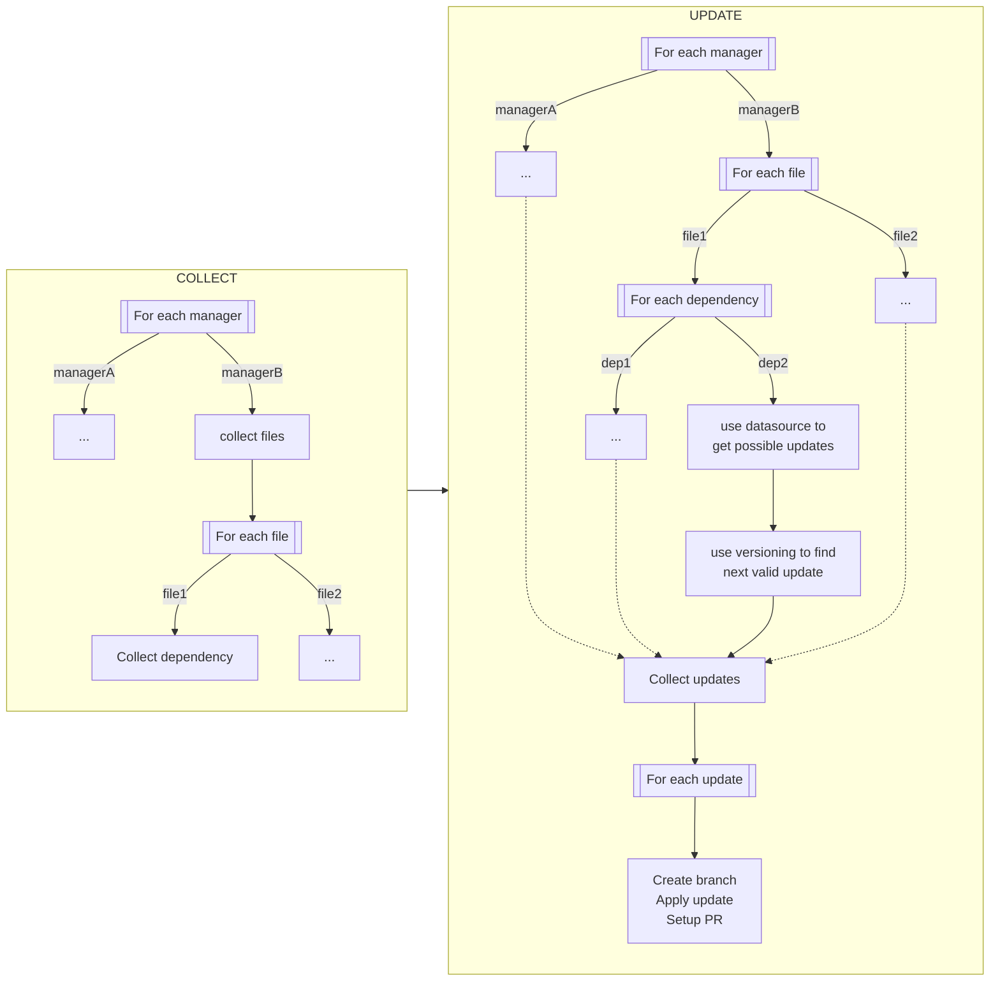

# Introduction

Renovate first finds all the dependencies in your repository, and then checks for updates to those dependencies.

Because Renovate needs to support a lot of dependency naming and versioning conventions, it has modules for each known convention.
You can define your own modules, if you want.

Please add comments to the [issue#25091](https://github.com/renovatebot/renovate/issues/25091) if you wish to see a part (better) shown in the graph below

## Modules

Renovate's modules are:

- [manager](../modules/manager/index.md)
- [datasource](../modules/datasource/index.md)
- [versioning](../modules/versioning.md).

Renovate uses these modules in order:

1. The manager module looks for files based on their name and extracts the dependencies (each dependency has a datasource)
2. The datasource module looks for the existing versions of the dependency
3. the versioning module search for a valid version regarding the dependency's version

For example:

1. the `gitlabci` manager finds a dependency named `python:3.10-alpine` of datasource `docker`
2. the `docker` datasource looks for versions and finds `[python:3.9,python:3.9-alpine,python:3.10,python:3.10-alpine,python:3.11,python:3.11-alpine]`
3. the `docker` versioning takes `python:3.11-alpine` as it is compatible with `python:3.10-alpine`

# Workflow

## Basic

Here's a high-level overview of Renovate's workflow, where it collects dependencies and then updates them:

## Advanced

Here's a detailed overview of the workflow:

```mermaid
flowchart TB
    subgraph INITIALIZATION
        direction TB
        MC[Merge configuration sources \n most important to least: \n cli > env > file > default]
        MC --> IP[Initialize platform]
        IP --> AD[Query the platform for repositories]
        AD --> NFIL[Narrow the list with filters]
    end

    subgraph REPOSITORY
       direction TB
       FER[[For each repository]]

      subgraph EXTRACTD[EXTRACT DEPENDENCIES]
          direction TB
          CLBRANCH[Collect existing branches]
          CLBRANCH --> VULN[Check for vulnerabilities]
          VULN --> CC[[For each manager]]
          CC -->|managerA| CD["..."]
          CC -->|managerB| CCF["match files"]
          CCF --> CFEF[[For each file]]
          CFEF -->|file1| CCD1[Extract dependency]
          CFEF -->|file2| CCD2[...]
      end

      subgraph COLLECTU[COLLECT UPDATES]
          direction TB
          UC[[For each manager]]
          UC -->|managerA| UD["..."]
          UC -->|managerB| UFEF[[For each file]]
          UFEF -->|file1| FED[[For each dependency]]
          UFEF -->|file2| FED2[...]
          FED -->|dep1| D1[...]
          D1 -..-> CU
          FED -->|dep2| D2[use datasource to \n fetch versions]
          D2 --> J[use versioning to find \n next valid update]
          FED2 -...-> CU
          UD -....-> CU
          J --> CU[Collect updates]
      end

      subgraph WRITEU[WRITE UPDATES]
        direction TB
        FEU[[For each update]]
        FEU --> AUCOND[Check if branch needed: \n existing/rebase/concurrent amount]
        AUCOND --> AU[Create branch\nApply update\nCreate PR]
      end

      subgraph FINALIZE[FINALIZE]
      direction TB
        CM[Check for config migration]
        CM --> CSB[Clean stale branches]

      end

      FER --> IRPO[Initialize repository]

      IRPO --> EXTRACTD
      EXTRACTD --> COLLECTU

      COLLECTU --> WRITEU

      WRITEU --> FINALIZE

    end

    INITIALIZATION --> REPOSITORY
```

