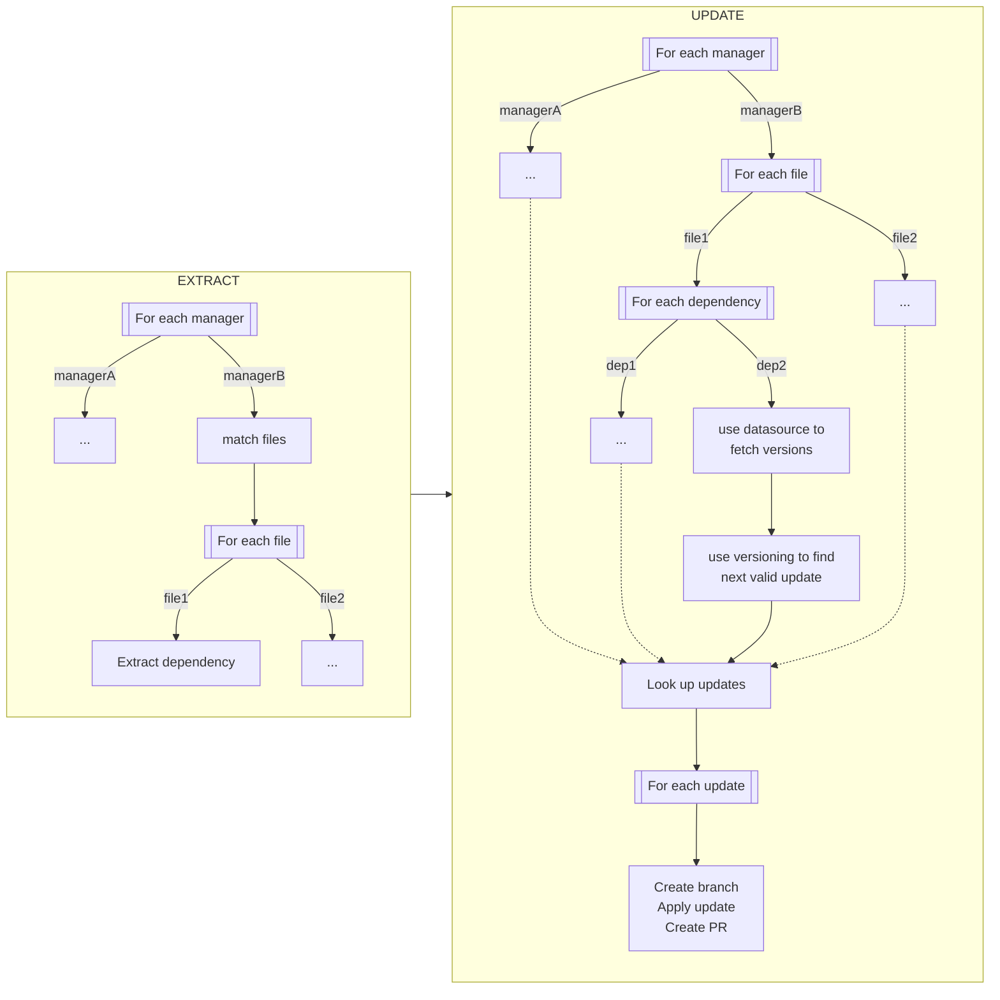

# Introduction

Renovate usually performs these steps:

- Cloning the repository
- Scanning package files to extract dependencies
- Looking up registries to check for available updates
- Applying any grouping rules defined
- Pushing branches and raising Pull Requests

Because Renovate needs to support a lot of dependency naming and versioning conventions, it has modules for each known convention.
You can contribute your own modules, if you want.

## Modules

Renovate's modules are:

- [datasource](../modules/datasource/index.md)
- [manager](../modules/manager/index.md)
- [platform](../modules/platform/index.md)
- [versioning](../modules/versioning.md).

Renovate uses these modules in order:

1. The platform module is used to interact with the source control platform and clone the repository
1. The manager module looks for files based on their name and extracts the dependencies (each dependency has a datasource)
1. The datasource module looks up versions of the dependency
1. The versioning module validates and sorts the returned versions

For example:

1. The `gitlabci` manager finds a dependency: `python:3.10-alpine` which has the `docker` datasource
2. The `docker` datasource looks for versions and finds: `[python:3.9,python:3.9-alpine,python:3.10,python:3.10-alpine,python:3.11,python:3.11-alpine]`
3. The `docker` versioning returns `python:3.11-alpine`, because that version is compatible with `python:3.10-alpine`

# Workflow

## Basic

Here's a high-level overview of Renovate's workflow, where it extracts dependencies and then updates them:

## Advanced

Here's a detailed overview of the workflow:

```mermaid
flowchart TB
    subgraph INITIALIZATION
        direction TB
        MC[Merge configurations \n most important to least: \n cli > env > file > default]
        MC --> IP[Initialize platform]
        IP --> AD[Query the platform for repositories]
        AD --> NFIL[Narrow the list with filters]
    end

    subgraph REPOSITORY
       direction TB
       FER[[For each repository]]

      subgraph EXTRACTD[EXTRACT DEPENDENCIES]
          direction TB
          CLBRANCH[Extract base branches]
          CLBRANCH --> VULN[Check for vulnerabilities]
          VULN --> CC[[For each manager]]
          CC -->|managerA| CD["..."]
          CC -->|managerB| CCF["match files"]
          CCF --> CFEF[[For each file]]
          CFEF -->|file1| CCD1[Extract dependency]
          CFEF -->|file2| CCD2[...]
      end

      subgraph LOOKUP[LOOK UP UPDATES]
          direction TB
          UC[[For each manager]]
          UC -->|managerA| UD["..."]
          UC -->|managerB| UFEF[[For each file]]
          UFEF -->|file1| FED[[For each dependency]]
          UFEF -->|file2| FED2[...]
          FED -->|dep1| D1[...]
          D1 -..-> CU
          FED -->|dep2| D2[use datasource to \n fetch versions]
          D2 --> J[use versioning to find \n next valid update]
          FED2 -...-> CU
          UD -....-> CU
          J --> CU[Look up updates]
      end

      subgraph WRITEU[WRITE UPDATES]
        direction TB
        FEU[[For each update]]
        FEU --> AUCOND[Check if branch needed: \n existing/rebase/concurrent amount]
        AUCOND --> AU[Create branch\nApply update\nCreate PR]
      end

      subgraph FINALIZE[FINALIZE]
      direction TB
        CM[Check for config migration]
        CM --> CSB[Clean stale branches]

      end

      FER --> IRPO[Initialize repository]

      IRPO --> EXTRACTD
      EXTRACTD --> LOOKUP

      LOOKUP --> WRITEU

      WRITEU --> FINALIZE

    end

    INITIALIZATION --> REPOSITORY
```

