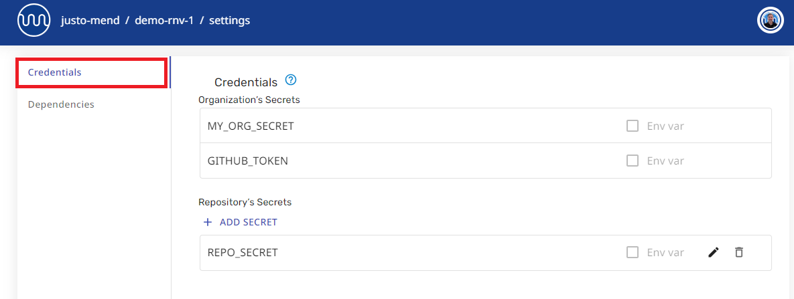
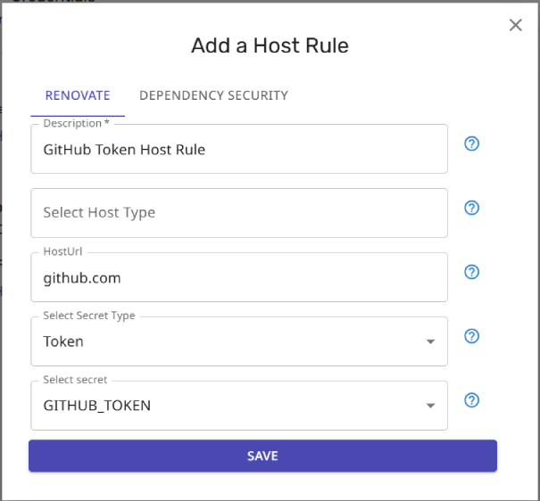

# Using secrets with Mend cloud Apps

The information on this page is for the Mend-hosted cloud apps:

- Renovate App on GitHub
- Mend App on Bitbucket
- Mend App on Azure DevOps

If you self-host, you can skip reading this page.

## :warning: Migrate secrets in your Renovate config file :warning:

The Mend Renovate cloud apps no longer read `encrypted` secrets from Renovate config files in your repositories.
You must migrate any secrets you currently keep in a Renovate config file, and upload them as secrets to org or repo settings pages on [developer.mend.io](https://developer.mend.io).
To add secrets you must have admin-level rights.

Read [Migrating encrypted secrets from Repo Config to App Settings](migrating-secrets.md) to learn more.

## Managing secrets via the Web UI

This section explains how to manage secrets for the Mend-hosted cloud apps via the Web UI.

Only administrators of an Org or Repo can manage the secrets for that Org or Repo.

### Adding a secret through the UI

To add a secret for the Mend cloud app:

1. Go to the web UI at [developer.mend.io](https://developer.mend.io).
2. Open your organization/repository settings.
3. Put the secret in the _Credentials_ section:

   

4. Reference the secret from Renovate config files inside the repo.
   Alternatively, you can use the Host Rules UI (see below).

   ```json
   {
     "hostRules": [
       {
         "matchHost": "github.com",
         "token": "{{ secrets.MY_ORG_SECRET }}"
       }
     ]
   }
   ```

### Adding a host rule through the UI

You can centrally add/configure Host Rules through the Mend UI as an alternative to including them in Renovate presets.

1. Open the _Credentials_ section of the settings page for the relevant Org or Repo.
2. Select `ADD HOST RULE` to open the "Add a Host Rule" dialog box.

   

3. Fill out the details for your host rule.

   As an example, if you are a Bitbucket or Azure DevOps user, and you want to specify a github.com token to fetch release notes and enable github-based datasources, you could create a host rule like this:

   

## Organization secrets vs repository secrets

### Secret scope

Secrets can be scoped to your organization _or_ to your repository:

| Secret scoped to your | What will happen?                                              |
| --------------------- | -------------------------------------------------------------- |
| Organization          | Secrets are inherited by all repositories in your organization |
| Repository            | Secrets are referenced by that repository only                 |

### Make changes on the right page

The web UI has _two_ settings pages.
One page is for the organization, and the other page is for the repository.

Make sure you're making the changes on the right page!

### Example


The screenshot shows inherited organization secrets and specific repository secrets.

### Managing organization-level secrets

The **Installed Repositories** table means you are on your organization's page.
Select the _Settings_ button to manage your organization secrets:


### Managing repository-level secrets

The **Recent jobs** table means you are on your repository's page.
Select the _Settings_ button to manage your repository secrets:


## Automating secrets via APIs (GitHub only)

Administrators of GitHub organizations and repositories can use the Developer Platform APIs to manage secrets.

See the [Developer Platform API documentation](https://api-docs.mend.io/developer-platform/1.0/repo-secret) for details.

### Authenticating the APIs

Calls to the APIs require authentication with a personal access token from the GitHub user making the request.
The token must be included in the request header as the `authorization` property.

You can use a [classic token](https://github.com/settings/tokens) or a [fine-grained token](https://github.com/settings/personal-access-tokens).
Mend recommends the use of fine-grained tokens for enhanced security.

#### Scopes and permissions for tokens

No additional scopes or permissions need to be added when calling APIs on _public_ repositories.
When calling APIs on _private_ repositories, the following scopes and permissions are required:

- Classic tokens require `repo` scope (Full control of private repositories)
- Fine-grained tokens must set the "Resource owner" as the org that the API is being called on, and must have a minimum of `metadata:read-only` permission on the selected repositories.

##### Fine-grained token example

To create a fine-grained token for the APIs, follow these steps:

- Provide a name for the token in the "Token name" field.
- [Optional] Provide a description for the token.


- Set the "Resource owner" to be the User or Org for the APIs that will be called.


- Choose an expiry date in the "Expiration" field.

- Choose the "Repository access" setting. If using APIs to update secrets on a private-repository, choose "All repositories" or "Only selected repositories".

- In the "Permissions" section, add permissions for "Metadata" (read-only).


## Known Issues

### Error deleting host rule from Developer Portal

Problem: When deleting a host rule from the Developer Portal, an error is shown "Error deleting host rule".

Workaround:
Update the host rule to point to a valid host that you are not using in your repo.
This way, the host rule will have no effect.
