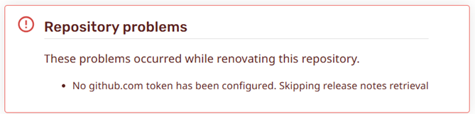
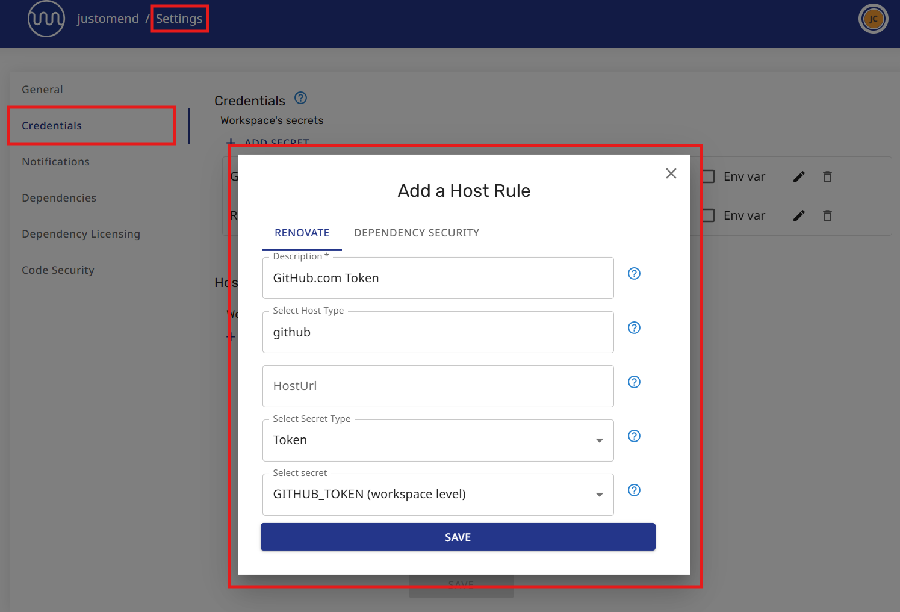

# Purpose of GitHub.com Token

Repositories that are NOT hosted on GitHub.com (Cloud) will require a token to access GitHub to retrieve release notes and change logs, plus some package files.

If a GitHub.com token is not provided, Renovate will continue to run, but with the following limitations

- release notes and change logs might be missing from Renovate pull requests
- updates will not be provided for packages that are only hosted on GitHub.com

## Do I need to provide a GitHub.com token?

### GitHub.com (Cloud) users

If your repositories are hosted on GitHub.com (Cloud) and you are using the Renovate App on GitHub, you do not need to provide a token for GitHub.com because the Renovate App already has access to GitHub.

### Bitbucket and Azure DevOps users

If your repositories are hosted on Bitbucket or Azure DevOps, you will need to provide a GitHub.com token if you want your Renovate CRs/MRs to contain release notes and change logs, or if you want updates on packages that live exclusively on GitHub.com.

If the GitHub.com token is not provided, a warning will be shown in the Developer Portal and in the Dependency Dashboard.

## How to provide a GitHub.com token

Renovate will accept a GitHub.com token from any GitHub user.
The token requires no special access or permissions.

### Step 1: Acquire a GitHub.com token:

1. Log in to GitHub.com (any user)
2. Navigate to [Personal access tokens](https://github.com/settings/tokens) in Developer settings
3. Choose `Generate new token` (either fine-grained or classic)
4. Provide a `Token name` (fine-grained) or `Note` (optional for classic token)
5. Choose the expiration date. (No additional scopes or repository permissions are required.)
6. Press `Generate token`
7. Copy the token when it is presented on the screen

> [!IMPORTANT]
>
> Make sure to copy your personal access token now as you will not be able to see this again.

### Step 2: Add the token to the Org/Repo credentials

Use the token generated in the previous step to provide a secret and host rule for the Org or Repos.

> [!NOTE]
>
> If a GitHub.com token is added to the settings for an Org, Workspace or Project, the token will be inherited by of its all child repositories.

1. Log in to [Developer Portal](https://developer.mend.io/)
2. Navigate to the Settings for an Org/Workspace/Project or a Repo
3. Go to the `Credentials` settings page
4. Choose `ADD SECRET` and create a secret to store the token

- Provide a `Secret Name` (e.g. `GITHUB_TOKEN`)
- Store the GitHub.com token in the `Secret Value`

6. Choose `ADD HOST RULE` and create a host rule for `github`

- Select host type `github`
- Select Secret Type as `Token`
- Select the GitHub.com token as the secret

For more information about providing Secrets and Host Rules in the Developer Portal UI, see the documentation about Credentials.
