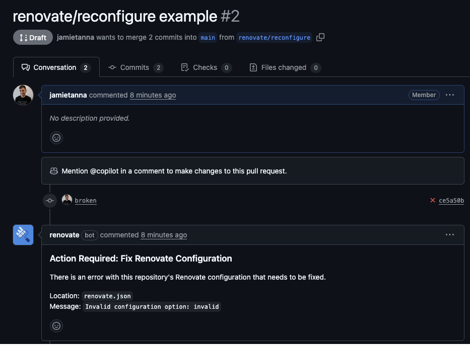

# Mend-hosted Apps Configuration

This page:

- covers all non-default Renovate behavior of these Mend-hosted apps
- is a supplement to the CLI documentation

<!-- prettier-ignore -->
!!! note
    For general configuration of the Renovate CLI, read the main [Configuration/Overview](../config-overview.md) section.

## Finding the logs

The Renovate logs for the Mend-hosted apps are on the [Mend Developer Portal](https://developer.mend.io).

Reading the logs can help you understand the configuration that Renovate used.

## Renovate Version

The Renovate version used by the Mend-hosted apps is updated manually by the maintainers of the app.
The maintainers don't follow any release schedule or release cadence, but try to update at least once a week.
This means the Mend Renovate App can lag a few hours to a week behind the open source version.

Major releases of Renovate are held back until the maintainers are reasonably certain it works for most users.

### Which version is the Mend Renovate app using?

Follow these steps to see which version the Mend Renovate app used for a specific job:

1. Sign in to the [Mend Developer Portal](https://developer.mend.io/) with your GitHub or Bitbucket account
1. Select your organization
1. Select a installed repository
1. Select a job from the _Recent jobs_ overview
1. Select the _Info_ Log Level from the dropdown menu
1. You should see something like this:

   ```
   INFO: Repository started
   {
     "renovateVersion": "39.11.5"
   }
   ```

<!-- prettier-ignore -->
!!! tip
    The PRs that Renovate creates have a link to the "repository job log" in the footer of the PR body text.

## Onboarding behavior

### Installing Renovate into all repositories leads to silent mode

If an Organization installed Renovate with "All repositories" (instead of "Selected repositories"), then Renovate defaults to "Silent" mode (`dryRun=lookup`).
We chose this behavior because:

- Too often an account or org administrator selects the "All repositories" option and accidentally onboards hundreds of repositories, and
- By offering this option, it means that org administrators _can_ install Renovate into "All repositories" without worrying about the noise, and let individual repository admins decide if/when to start onboarding

#### Why we call this silent mode

- It's not just no PRs, it's also no Issues
- It's a common term across other Mend capabilities, such as OSS security and SAST security, where status checks also use silent/non-silent

### Get onboarding PRs from Renovate by getting out of silent mode

If Renovate is installed, _and_ you can see a job log, but Renovate is _not_ onboarding your repository: look for `dryRun` in the logs to confirm you are in Silent mode.
To get a onboarding PR from Renovate, change to Interactive mode either at the Repository level or Organization level.

### Installing Renovate into selected repositories always leads to onboarding PRs

Additionally, if an Organization is installed with "Selected repositories" then the app will change `onboardingNoDeps` to `"enabled"`.
This change causes Renovate to create an Onboarding PR, even if Renovate does not detect any dependencies.

## Fork Processing

If an Organization installs Renovate with the "All repositories" option, then `forkProcessing` will remain set to its default value `disabled`.
This means forked repositories are _not_ onboarded, Renovate ignores them.
To change this behavior, push a `renovate.json` file to the repository with `"forkProcessing": "enabled"`.

If an Organization installs Renovate with "Selected repositories", we assume the organization wants to onboard _all_ of the selected repositories, even forked repositories.
Therefore we set `forkProcessing` to "enabled".

## Inherited config

The Mend Renovate app automatically applies inherited config to all installed repositories in an organization, if these conditions are met:

1. A repository called `renovate-config` exists in the same organization, and the organization has installed the Mend Renovate app. The repository does not need to be onboarded
1. Renovate finds a file called `org-inherited-config.json` in the `renovate-config` repository

If you use a Mend-hosted app, you can _not_ change the values for the `inheritConfigFileName` and the `inheritConfigRepoName` config options.

To avoid wasted API calls, Mend apps will enable `inheritConfig` in an org only when Renovate detects a commit for the `inheritConfig` file.
This means the `inheritConfig` file will not be detected if the Mend Renovate app is not installed on the `renovate-config` repository at the time of adding or changing the file.
If you have such a file but the Mend app has not enabled `inheritConfig` in your org, try pushing a commit to that file and wait a minute to see if Renovate detects the change.

## Default presets

The Mend Renovate app automatically adds the `mergeConfidence:all-badges` preset to the `extends` array.
If you do not want the Merge Confidence badges: add the `mergeConfidence:all-badges` preset to the `ignorePresets` array.

Additionally, the preset `config:recommended` is added to `onboardingConfig`.

## Allowed Post-upgrade commands

A limited set of approved `postUpgradeTasks` commands are allowed in the app.
The commands are not documented, as they may change over time.

You can find the allowed `postUpgradeTasks` commands in Renovate's log output, when searching for a log line which references [`allowedCommands`](../self-hosted-configuration.md#allowedcommands).

## Validating configuration

As noted in [Validation of Renovate config change PRs](../config-validation.md#validation-of-renovate-config-change-prs), Renovate will automagically validate your configuration changes when pushing to the "reconfigure" branch.

<!-- prettier-ignore -->
!!! tip
    When using a Mend-hosted app, the "reconfigure" branch is `renovate/reconfigure`.

When pushing to this specific branch name, Renovate will run its validation and report a status check to the Platform whether this passes/fails validation.

If you have a Pull Request open from this branch (including draft PRs), Renovate will comment on the PR to note:

- If there are any failures, and if so, what's wrong
- If the configuration passed validation, and if so, what the new configuration will do

[For example](https://github.com/JamieTanna-Mend-testing/mend-reconfigure/pull/2), when failing validation:

{ loading=lazy }

And when the PR then passes validation:

![A similar view of the same Pull Request, but with a new commit reverting the 'broken' changes. We can see a green tick status check showing that Renovate's config validation passed the commit, and below there is a lengthy comment from Renovate summarising the configuration presets (as it would do when performing an onboarding PR - in this case, taking the description of all presets used. Additionally, there is a 'what to expect' section which notes that the repo is up-to-date so no new PRs would be raised by Renovate](../assets/images/mend-hosted-reconfigure-passed.png){ loading=lazy }
