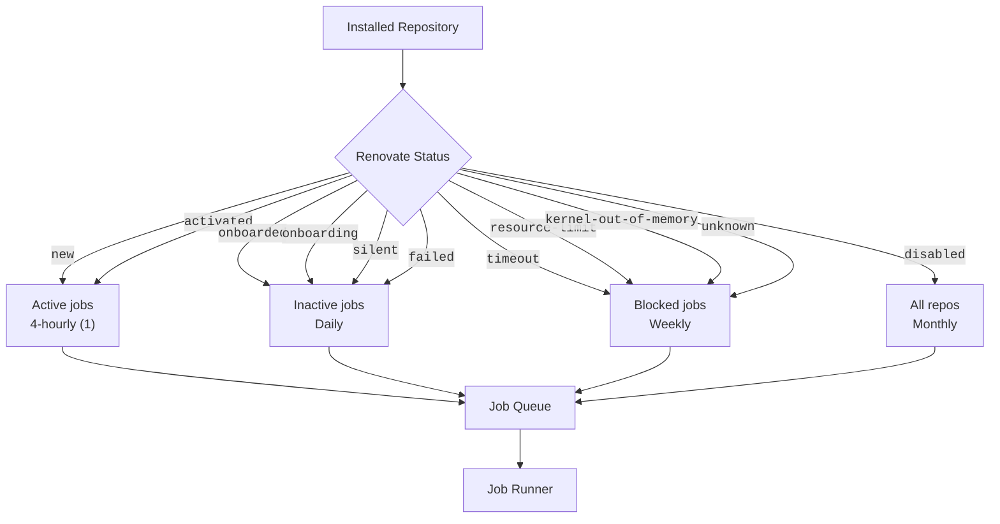

# Job Scheduling & Renovate Status

Mend Renovate Cloud will automatically schedule Renovate jobs to be run on installed repos.
When the scheduler runs, selected repositories are added to the Job Queue, and eventually executed by the job runners.

## Job Schedulers

There are four types of job schedulers, each with a different frequency and selection of repositories.

| Job Scheduler | Frequency    | Renovate statuses                                      |
| ------------- | ------------ | ------------------------------------------------------ |
| Active jobs   | 4-hourly (1) | new, activated                                         |
| Inactive jobs | Daily        | onboarded, onboarding, silent, failed                  |
| Blocked       | Weekly       | timeout, resource-limit, kernel-out-of-memory, unknown |
| All repos     | Monthly      | All installed repos (including disabled)               |

(1) Renovate Enterprise jobs are scheduled every hour for repositories on GitHub and Azure DevOps.

## Renovate Status

Each repository installed with Renovate Cloud has a Renovate Status. The Renovate Status is used by the job scheduler to determine which repositories will be selected.
The status appears in the list of repositories shown on the Org page of the Developer Portal.

The table below describes all the Renovate statuses.

| Renovate Status      | Description                                           | Schedule |
| -------------------- | ----------------------------------------------------- | -------- |
| <-blank->            | New repo. Renovate has never run on this repo.        | Hourly   |
| onboarding           | Onboarding PR has not been merged                     | Daily    |
| onboarded            | Onboarding PR has been merged. No Renovate PRs merged | Daily    |
| activated            | At least one Renovate PR has been merged              | Hourly   |
| silent               | Renovate will run, but not deliver PRs or issues      | Daily    |
| failed               | An error occurred while running the last job          | Daily    |
| timeout              | A timeout occurred while running the last job         | Weekly   |
| kernel-out-of-memory | An OOM error occurred while running the last job      | Weekly   |
| resource-limit       | A resource limit was hit while running the last job   | Weekly   |
| unknown              | An unknown error occurred while running the last job  | Weekly   |
| disabled             | Renovate will not run on this repository              | Monthly  |

(1) Renovate Enterprise jobs are scheduled every hour for repositories on GitHub and Azure DevOps.
