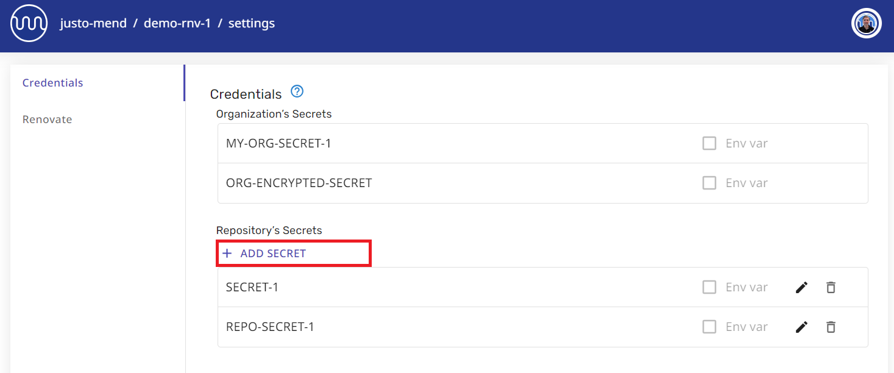
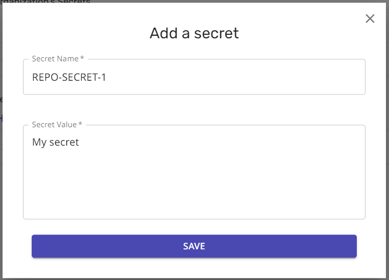

# Migrating Secrets from Repo Config to App Settings

The Mend Renovate Cloud apps no longer read encrypted secrets from Renovate config files in your repositories.
Previously, you could encrypt a secret with the [Renovate encryption tool](https://app.renovatebot.com/encrypt) and then put it in your Renovate config file.

When using the Mend Renovate Cloud apps, all secrets must be stored in the App settings on the cloud.
The secrets can be referenced from the Renovate config files inside the repo using `{{ secrets.SECRET_NAME }}` notation.

## Old method

This method is deprecated:

```json title="Put encrypted secret in Renovate config"
{
  "hostRules": [
    {
      "matchHost": "github.com",
      "encrypted": {
        "token": "drsMDVf6M2hTZCN......+gQm/0Rpw"
      }
    }
  ]
}
```

## New method

This is the new method that you should start using:

```json title="Reference the app secret in the Renovate config"
{
  "hostRules": [
    {
      "matchHost": "github.com",
      "token": "{{ secrets.GITHUB_COM_TOKEN }}"
    }
  ]
}
```

## Tips

### Do not change the secret during migration

Mend recommends that you do _not_ change the secret during the migration, as this introduces an extra point of failure.
After the migration you can of course change/rotate the secret.

### Migrate your secrets in the raw form (plain text)

When migrating secrets, DO NOT migrate the encrypted form of the secret.
You must input the secret in the web UI from plain text. (The web UI will store the value securely.)
If you do not have the original plain text form of the secret being migrated, you will need to create a new secret.

## How to migrate secrets

### Use Plain text values - not encrypted values

You must Migrate encrypted secrets using the PLAIN TEXT value. You can not use the encrypted version of the secret.

### Add the secret to the correct Org or Repo

When you migrate a secret from a repository, make sure you are adding the secret to the _same_ organization or repository for which you generated the secret!

- A secret generated for a specific repository can only be added to that _same_ repository.
- A secret generated for a specific repository can only be added to the repository settings for the matching repository. This secret can _not_ be added to the organization's settings.
- A secret generated without a specific repository _can_ be added into the organization _or_ into the repository settings under that organization.

### Steps to migrate a secret to the Renovate Cloud App

1. Go to the correct settings page for your organization or repository in the web UI at [developer.mend.io](https://developer.mend.io).

2. On the **Credentials** page, select `ADD SECRET` to add the plaintext secret.
   

3. Give a value for `Secret name`, paste the plaintext secret into the `Secret Value` field, and select `SAVE`.
   

4. Wait for the confirmation dialog: **“Successfully stored secret”**.
   

## Troubleshooting

### Secret is stored successfully, but it doesn't work when used in the app

The secret might be wrong. Try uploading the secret again.

- Ensure that the PLAIN TEXT value of the secret is used - not the encrypted value.
- Ensure that the secret was uploaded to the correct Org or Repo.

## Related links

- [Using Secrets with Mend Cloud Apps](credentials.md)
