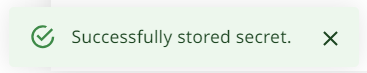
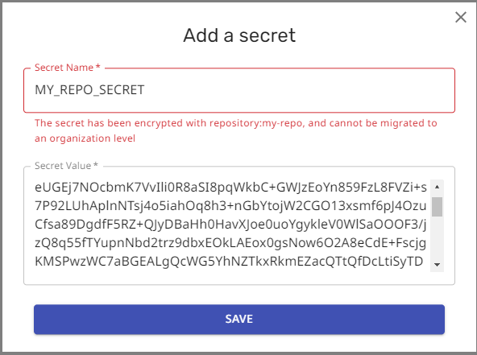

# Migrating Secrets from Repo Config to App Settings

Use of encrypted secrets in the Mend Renovate cloud apps has been deprecated and soon the apps will stop reading any encrypted secrets from the Renovate configuration file on your repository.
Previously, you could encrypt a secret with the [Renovate encryption tool](https://app.renovatebot.com/encrypt) and then put it in your Renovate config file.

Going forward, all secrets must be stored in the App settings on the cloud.
They can be referenced from the Renovate config files inside the repo using `{{ secrets.SECRET_NAME }}` notation.

## Old method

This method is deprecated:

```json title="Put encrypted secret in Renovate config"
{
  "hostRules": [
    {
      "matchHost": "github.com",
      "encrypted": {
        "token": "drsMDVf6M2hTZCN......+gQm/0Rpw"
      }
    }
  ]
}
```

## New method

This is the new method that you should start using:

```json title="Reference the app secret in the Renovate config"
{
  "hostRules": [
    {
      "matchHost": "github.com",
      "token": "{{ secrets.GITHUB_COM_TOKEN }}"
    }
  ]
}
```

## Tips

### Migrate your secrets in encrypted form

Mend recommends that you copy your secrets in their _encrypted_ form when you migrate.
The web UI will decrypt and store the value securely.

### Do not change the secret during migration

Mend also recommends that you do _not_ change the secret during the migration, as this introduces an extra point of failure.
After the migration you can of course change/rotate the secret.

## Two ways to migrate

There are two ways to migrate your secrets:

1. Migrate encrypted secrets using the encrypted value
2. Migrate encrypted secrets using the plain text value

Mend recommends the first way.

### Migrate encrypted secrets using the encrypted value

1. Copy the encrypted secret from your Renovate config file.
2. Go to the correct settings page for your organization or repository in the web UI at [developer.mend.io](https://developer.mend.io).
3. On the **Credentials** page, select `ADD SECRET` to add the encrypted secret.
4. Give a value for `Secret name`, paste the encrypted secret into the `Secret Value` field, and select `SAVE`.
5. When you migrate a secret from a repository, make sure you are adding the secret to the _same_ organization or repository for which you generated the secret!
   - A secret generated for a specific repository can only be added to that _same_ repository.
   - A secret generated for a specific repository can only be added to the repository settings for the matching repository. This secret can _not_ be added to the organization's settings.
   - A secret generated without a specific repository _can_ be added into the organization _or_ into the repository settings under that organization.
6. If you see the confirmation box with the text: **“Successfully migrated secret”**, your secret is now stored in the correct organization or repository.
   

### Migrate encrypted secrets using the plain text value

1. Go to the settings for the correct organization or repository in the web UI at [developer.mend.io](https://developer.mend.io).
2. On the **Credentials** page, select `ADD SECRET` to add the plaintext secret.
   
3. Give a value for `Secret name`, paste the plaintext secret into the `Secret Value` field, and select `SAVE`.
   
4. Wait for the confirmation dialog: **“Successfully stored secret”**.
   

## Troubleshooting

### Are you trying to add the secret to the wrong place?

If you accidentally end up in the wrong place, the settings UI will help you:



## The confirmation box says "Successfully store secret", what does this mean?

If the confirmation box says: **“Successfully stored secret”** then the secret was not detected as a Renovate encrypted secret.
This means the value was treated as plaintext.

If you were expecting to import a secret originally encrypted by Renovate:

1. Make sure you are pasting the secret into the correct organization or repository
2. Check that you copied the encrypted secret correctly, and try again.

## Related links

- [Using Secrets with Mend Cloud Apps](credentials.md)
