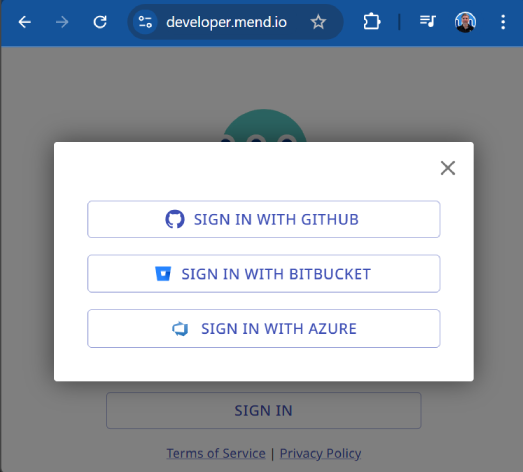

# Mend Renovate Cloud-hosted (Community and Enterprise)

Mend provides cloud hosting services for running Renovate in free and paid versions:

- Mend Renovate Community Cloud (Free)
- Mend Renovate Enterprise Cloud (Paid)

They are available for Git repositories hosted on the following cloud platforms:

- GitHub
- Bitbucket Cloud
- Azure DevOps

Mend Renovate cloud will regularly schedule Renovate jobs against all installed repositories.
It also listens to webhooks and enqueues a Renovate job when relevant changes occur in a repo, or when actions are triggered from the Renovate PRs or Dashboard issue.
There is a web UI with functionality to view and interact with installed repositories, their jobs and job logs.

## Getting started

To get started using Mend Renovate Cloud versions, access the Developer Portal at [https://developer.mend.io/](https://developer.mend.io/).

Developers can log in using the OAuth credentials from their cloud-based Git repository.

Features of the Developer Portal include:

- Ability to install, uninstall and view installed repositories
- Trigger Renovate jobs to run on demand
- View logs for all Renovate jobs
- Configure settings that apply at the Org-level or Repo-level

## Plans

### Mend Renovate Community Cloud

A generous free tier, available for all across an unlimited number of public and private repositories.

### Mend Renovate Community (OSS) Cloud

As part of Mend's commitment to support the Open Source community, we provide an enhanced free offering for maintainers of the projects the ecosystem rely upon.

This offering provides increased resources and concurrency, as well as access to [Merge Confidence Workflows](../merge-confidence.md#merge-confidence-workflows) to allow maintainers to more intelligently receive updates based on signals Mend collects from other projects.

Projects licensed under an Open Source Initiative (OSI) approved license can request increased resources on Mend Renovate Cloud under the Community (OSS) plan.

<!-- prettier-ignore -->
!!! tip
    To request increased resources, create a [Mend Hosted Request](https://github.com/renovatebot/renovate/discussions/new?category=mend-hosted-request) on the Renovate GitHub Discussions board.
     
    Acceptance is at the discretion of Mend.

### Mend Renovate Enterprise Cloud

Mend's premium offering for our Cloud product, with support, enhanced scalability and scheduling, and access to [Merge Confidence Workflows](../merge-confidence.md#merge-confidence-workflows).

Contact Mend at [sales@mend.io](mailto:sales@mend.io) for purchase details.

### Resources and Scheduling

The resources, scheduling and concurrency of Renovate jobs is determined by the Mend Renovate plan used by the Org, which can be seen below:

|                               | Mend Renovate Community Cloud | Mend Renovate Community (OSS) Cloud | Mend Renovate Enterprise Cloud |
| ----------------------------- | ----------------------------- | ----------------------------------- | ------------------------------ |
| Concurrent jobs per Org       | 1                             | 2                                   | 16                             |
| Job scheduling (active repos) | Every 4 hours                 | Every 4 hours                       | Hourly1             |
| Job runner CPUs               | 1 vCPU                        | 2 vCPU                              | 2 vCPU                         |
| Job runner Memory             | 3GB                           | 6GB                                 | 8GB                            |
| Job runner Disk space         | 15GB                          | 25GB                                | 40GB                           |
| Job timeout                   | 30 minutes                    | 60 minutes                          | 60 minutes                     |
| Merge Confidence Workflows    | ❌ Not included               | ✅ Included                         | ✅ Included                    |
| Mend.io Helpdesk Support      | ❌ Not included               | ❌ Not included                     | ✅ Included                    |

1 Bitbucket repositories running Mend Renovate Enterprise are scheduled to run every 4 hours, to avoid hitting rate limits on GitHub APIs.
