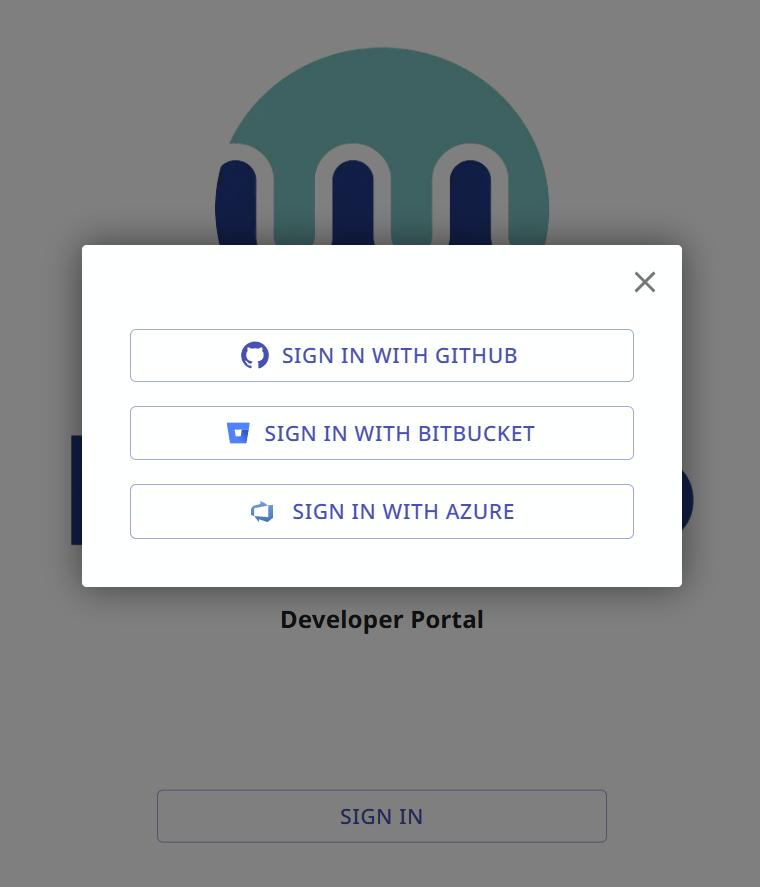

# Mend Renovate Cloud-hosted (Community and Enterprise)

Mend provides cloud hosting services for running Renovate in free and paid versions:

- Mend Renovate Community Cloud (Free)
- Mend Renovate Enterprise Cloud

They are available for Git repositories hosted on the following cloud platforms:

- GitHub
- Bitbucket Cloud
- Azure DevOps

Mend Renovate cloud will regularly schedule Renovate jobs against all installed repositories.
It also listens to webhooks and enqueues a Renovate job when relevant changes occur in a repo, or when actions are triggered from the Renovate PRs or Dashboard issue.
There is a web UI with functionality to view and interact with installed repositories, their jobs and job logs.

## Getting started

To get started using Mend Renovate Cloud versions, access the Developer Portal at [https://developer.mend.io/](https://developer.mend.io/).

Developers can log in using the OAuth credentials from their cloud-based Git repository.

Features of the Developer Portal include:

- Ability to install, uninstall and view installed repositories
- Trigger Renovate jobs to run on demand
- View logs for all Renovate jobs
- Configure settings that apply at the Org-level or Repo-level

## Resources and Scheduling

The resources, scheduling and concurrency of Renovate jobs is determined by the version of Mend Renovate used by the Org.
Details of the Mend Renovate Cloud versions are shown in the table below.

|                               | Mend Renovate Community Cloud (Free) | Mend Renovate Enterprise Cloud |
| ----------------------------- | ------------------------------------ | ------------------------------ |
| Concurrent jobs per Org       | 1                                    | 16                             |
| Job scheduling (active repos) | Every 4 hours                        | Hourly (\*1)                   |
| Job runner CPUs               | 1 CPU                                | 2 CPU                          |
| Job runner Memory             | 2Gb                                  | 8Gb                            |
| Job runner Disk space         | 15Gb                                 | 40Gb                           |
| Job timeout                   | 30 minutes                           | 60 minutes                     |
| Merge Confidence Workflows    | Not included                         | Included                       |
| Mend.io Helpdesk Support      | Not included                         | Included                       |

(1) Bitbucket repositories running Mend Renovate Enterprise are scheduled to run every 4 hours, to avoid hitting rate limits on GitHub APIs.

**Mend Renovate Community Cloud (Free)** - Available for free for all repositories.

**Mend Renovate Enterprise Cloud** - Supported premium version. Contact Mend at [sales@mend.io](mailto:sales@mend.io) for purchase details.

<!-- prettier-ignore -->
!!! note
    OSS-licensed orgs can request increased resources on Mend Renovate Community Cloud.
    To request increased resources, create a “[Suggest an Idea](https://github.com/renovatebot/renovate/discussions/categories/suggest-an-idea)” item on the Renovate discussions board on GitHub.
    Acceptance is at the discretion of Mend.io.
