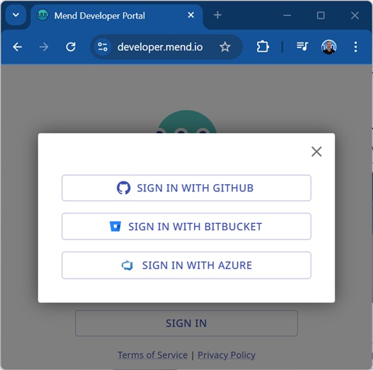

# Renovate Plans on Mend-Hosted Apps

Mend provides cloud hosting services for running Renovate on repositories hosted on the following cloud platforms:

- GitHub
- Bitbucket
- Azure DevOps

Mend Cloud will regularly schedule Renovate jobs against all installed repositories.
It also listens to changes on the repos and triggers a Renovate job when changes occur in the repo,
or when actions are triggered from the Renovate PRs or Dashboard issue.
There is a web UI with functionality to view and interact with installed repositories, their jobs and job logs.

## Accessing Mend Cloud via the Web UI

Users can access the cloud-hosted Renovate service via the Developer Portal at [https://developer.mend.io/](https://developer.mend.io/).
Developers can log in with credentials from their cloud-based Git repository.

Features of the Developer Portal include:

- Ability to install, uninstall and view installed repositories
- Trigger Renovate jobs to run on demand
- View logs for all Renovate jobs
- Configure settings that apply at the Org-level or Repo-level

## Resources and Scheduling

Worker machine resources and the scheduling of Renovate jobs is defined by the plan assigned to each Org.
Mend Cloud has free and paid Renovate plans. Details of the plans are shown in the table below.

|                               | Community (Free) | Pioneer (Free) | OSS Select (Free) | Enterprise   |
| ----------------------------- | ---------------- | -------------- | ----------------- | ------------ |
| Concurrent jobs per Org       | 1                | 8              | 2                 | 16           |
| Job scheduling (active repos) | Every 4 hours    | Every 4 hours  | Hourly            | Hourly (\*1) |
| Job runner CPUs               | 1 CPU            | 1 CPU          | 1 CPU             | 2 CPU        |
| Job runner Memory             | 2Gb              | 3.5Gb          | 6Gb               | 8Gb          |
| Job runner Disk space         | 15Gb             | 15Gb           | 25Gb              | 40Gb         |
| Job timeout                   | 30 minutes       | 30 minutes     | 60 minutes        | 60 minutes   |
| Merge Confidence Workflows    | Not included     | Not included   | Included          | Included     |
| Mend.io Helpdesk Support      | Not included     | Not included   | Not Included      | Included     |

(1) Bitbucket repositories on the Renovate Enterprise plan are scheduled to run every 4 hours, to avoid hitting rate limits on GitHub APIs.

### Plan descriptions

**Community (Free)** - This plan is available for free for all repositories.

**Pioneer (Free)** - This plan is available for a limited time for Orgs that were installed on Renovate Cloud before 2025. Users on this plan will be transitioned to other plans over time.

**OSS Select (Free)** - This is a premium plan granted for free to selected OSS Orgs. If you would like your Org to be considered for the free OSS Select plan, create a “[Suggest an Idea](https://github.com/renovatebot/renovate/discussions/categories/suggest-an-idea)” item on the Renovate discussions board on GitHub.

**Enterprise** - A supported, paid plan available for purchase through Mend.io. See options below.

### Purchase Renovate Enterprise Plan

Options to purchase the Renovate Enterprise plan include:

- Contact Mend at [sales@mend.io](mailto:sales@mend.io) for purchase details via invoice.
- Customers who are using AWS or Azure Marketplaces can purchase the Enterprise Plan directly using the links below.
  - [Mend AppSec Platform on AWS Marketplace](https://aws.amazon.com/marketplace/pp/prodview-yinerd2u4nhw4?sr=0-1&ref_=beagle&applicationId=AWSMPContessa)
  - [Mend AppSec Platform on Azure Marketplace](https://azuremarketplace.microsoft.com/en-us/marketplace/apps/whitesource-software.whitesource_enterprise?tab=Overview)

Once sales have been finalized, the specific Orgs will be enabled with the Renovate Enterprise plan for Mend staff.
