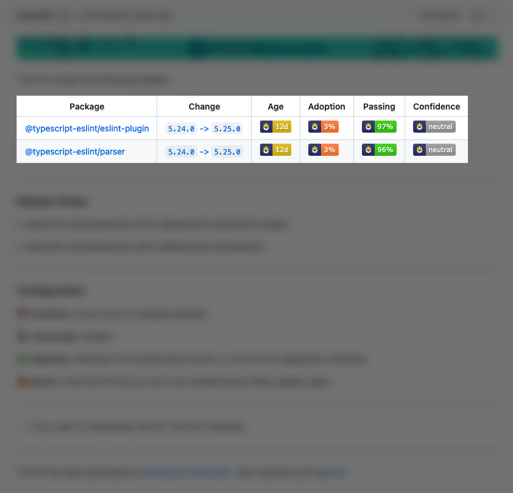

# Merge Confidence

Look at the Merge Confidence badges before merging to:

- Prevent updates which break in production
- See at a glance if you should update

Merge Confidence finds and flags undeclared breaking releases.
It analyzes test and release adoption data from the Mend Renovate App users.



## Pull request badges

Merge Confidence adds the following badges to your pull requests:

- **Age**: The age of the package
- **Adoption**: The percentage of this package's users (within Renovate) which are using this release
- **Passing**: The percentage of updates which have passing tests for this package
- **Confidence**: The confidence level for this update

## Supported platforms

Merge Confidence badges for pull requests are available on any supported platform or Renovate distribution, including Mend Remediate.

## Supported languages

Data is available for packages from:

- npm
- Maven
- PyPI

We plan to support more languages soon.

## Enabling and disabling

If you use the Mend Renovate App then the badges are enabled automatically.

If you're self-hosting Renovate, you can enable the badges by adding the `mergeConfidence:all-badges` preset to the `extends` array in your Renovate config:

```json
{
  "extends": ["mergeConfidence:all-badges"]
}
```

<!-- prettier-ignore -->
!!! note
    The `mergeConfidence:age-confidence-badges` preset can be used to only show the Age and Confidence badges.

If you want to disable the badges in the Mend Renovate App, add the `mergeConfidence:all-badges` preset to the `ignorePresets` array in your config:

```json
{
  "ignorePresets": ["mergeConfidence:all-badges"]
}
```

## Confidence levels and their meaning

Merge Confidence uses the following confidence levels:

- **Low**: We think the update contains breaking changes. Often this is expected because it's a `major` version update, but updates can have unknown breaking changes
- **Neutral**: We don't have enough data about the update, or we can't decide if the update should be Low or High confidence
- **High**: We rank updates as High confidence when the combination of `Age`, `Adoption` and `Passing` tests means there's a very low chance of breaking changes
- **Very High**: We only use this for updates which are months old and have either high `Adoption` or have very high test `Passing` scores

## How it works

The Mend Renovate App created millions of pull requests on `github.com` to help developers update their dependencies since 2017.
We bundle and analyze metrics such as package `Age`, package `Adoption`, and `Passing` tests.
This way we can find packages that have undeclared breaking changes.

### Algorithm

The algorithm that decides on the values is private and is not something we plan to share.
Similar to a search engine's algorithm, we plan to adjust and improve it over time, for example by using historical data to set a baseline confidence level for packages.

### Data

We plan to expose much more of the data via a companion website, such as number of users of a package and popular repositories which already updated to the version in question.

## Explanations

### Package ranking

npm packages less than three days old can be [unpublished](https://docs.npmjs.com/policies/unpublish), which can result in a service impact if you have updated to a package that gets unpublished.
This is why npm packages can only get the **High** Confidence badge when they are at least three days old.

### Percentage values weighting

The percentages for `Adoption` and `Passing` are weighted towards Organizations, private repositories, and projects with high test reliability.
This means those values aren't _raw_ percentages.

## Questions and feedback

You are invited to [start a discussion](https://github.com/renovatebot/renovate/discussions/new/choose) if you have anything you'd like to discuss.
