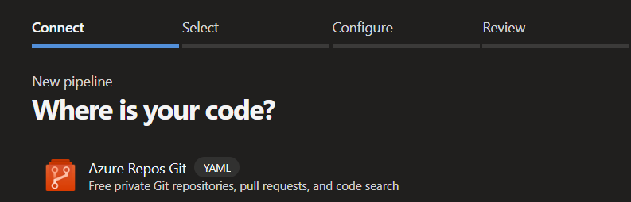
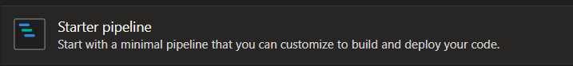

# Azure DevOps Setup (for NPM/YARN)

1. Create a brand new pipeline within Azure DevOps, and select your source.



1. Select your repository.

1. Within <i>Configure your pipeline</i> select: <b>Starter pipeline file</b>.



1. Replace all contents with next NPM/YARN template (change all <i>PLACEHOLDER</i> strings with your values):

```
schedules:
  - cron: '0 3 * * *'
    displayName: 'Every day at 3am'
    branches:
      include:
        - master
    always: true

trigger: none

jobs:
  - job:
    pool:
      vmImage: 'ubuntu-latest'
    steps:
      - checkout: none

      - task: Bash@3
        displayName: Create .npmrc file
        inputs:
          targetType: inline
          script: |
            cat > .npmrc << EOF
            PLACEHOLDER(.NPMRC CONTENTS)
            EOF

      - task: npmAuthenticate@0
        displayName: npm Authenticate
        inputs:
          workingFile: .npmrc

      - task: Bash@3
        displayName: Create renovate config
        inputs:
          targetType: inline
          script: |
            cat > config.js << EOF
            module.exports = {
              platform: 'azure',
              endpoint: 'https://dev.azure.com/PLACEHOLDER(ORGANIZATION)/',
              token: '$(System.AccessToken)',
              npmrc:
                '$(sed ':a;N;$!ba;s/\n/\\n/g' .npmrc)',
              ignoreNpmrcFile: true,
              repositories: ['PLACEHOLDER(PROJECT)/PLACEHOLDER(REPO NAME)']
            };
            EOF

      - task: Bash@3
        displayName: Run renovate
        inputs:
          targetType: inline
          script: |
            # Git credentials
            git config --global user.email 'bot@renovateapp.com'
            git config --global user.name  'Renovate Bot'
            # Run renovate
            npx --userconfig .npmrc renovate
```

1. Additionally, you can add `renovate.json` with renovate configurations in the root of the repo.
   [Read more about configurations options](https://docs.renovatebot.com/configuration-options/).
