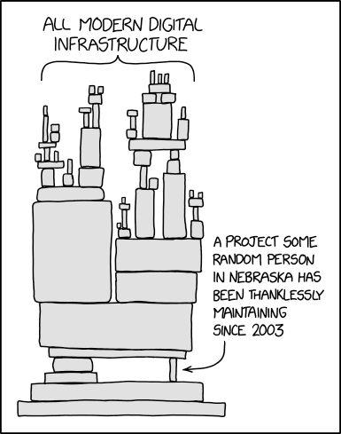
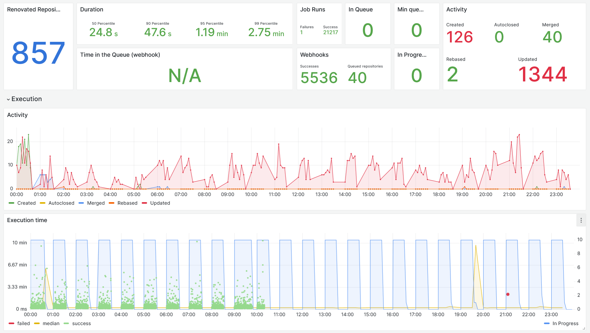

<!-- hide table of contents in navigation sidebar -->

# How Swissquote is keeping software dependencies up-to-date with Renovate

> This article was originally published on [Medium](https://medium.com/swissquote-engineering/how-swissquote-is-keeping-software-dependencies-up-to-date-with-renovate-6246e8b20437) by [Stéphane Goetz](https://onigoetz.ch/), Principal Software Engineer at [Swissquote Bank](https://github.com/swissquote/).

Swissquote has more than 1000 distinct applications running in production.
They come in many different flavors including services, daemons, and web apps, and their age can be counted from days to more than a decade.
While there are many topics of interest when talking about software maintenance, today’s topic is software dependencies.
We’ll see in this article why it’s important to keep them up-to-date and why it’s not as simple as one may think.

Software dependencies have been a heavily discussed topic in the past months.
One aspect that’s discussed a lot is security issues like the recent [Log4Shell](https://en.wikipedia.org/wiki/Log4Shell), [Supply chain attacks](https://blog.sonatype.com/npm-project-used-by-millions-hijacked-in-supply-chain-attack), [an expiring SSL Certificate](https://www.webnic.cc/root-ssl-certificate-expiry-and-what-happens-next-for-brands/).
But there are also other aspects like bugs caused by your dependencies.

Depending on third-party software is a sword of Damocles; you never know when a new issue will force you to drop everything to upgrade your software.

<figure markdown>
  { loading=lazy }
  <figcaption><a href=https://xkcd.com/2347/>XKCD comic 2347</a> is always relevant when talking about dependencies.</figcaption>
</figure>

Each software dependency is a risk.
For example: SQL Injections, is the ORM you are using properly escaping the content you are passing to it?
Will your current driver be able to connect to your database if it gets upgraded?
Every dependency, while solving an issue for you, will also bring new risks to your software.
How can you mitigate those risks?

If the title of the article is of any help, the idea would be to keep your dependencies up-to-date to fix bugs, security issues, and more.

## I don’t feel like upgrading, what if?

But what if the upgrades do the complete opposite?
What if the new version introduces a new security issue?

For example, a new version of a dependency could be victim of a supply chain attack.
If you never update your dependencies, you won’t get the infected version.
Sounds fair, right?

It’s a valid argument, but your application doesn’t exist in a vacuum; many external factors could force you to upgrade at some point, and when it happens it’s usually at the wrong time.

Let’s go through some examples.

### An external factor has changed, forcing you to change your app

Let’s say the machine your apps runs on is obsolete and you need to move to another machine.
This could be as simple as “install app on machine; done” but usually ends up with:

1. The newer OS version prevents you from installing an outdated runtime
1. You need to find a compatible runtime for your new hardware
1. Your app’s dependencies aren’t compatible with your new runtime, you need to update them as well

Instead of a single change, you now have a combination of changes, each can go wrong in a different way.

### A new vulnerability is found on a library you depend on

As we’ve covered at the beginning of the article this can happen and can be an all-hands-on-deck kind of situation.
Imagine a legacy application; continuous integration is constantly failing — or worse it may not even exist.
How long do you think it will take to deploy that single library update?

### The team already has too many dependencies in too many different versions

That’s unfortunate, but it will happen if your team or company exists for long enough.
Upgrading libraries is not only about bumping versions, sometimes it’s also about replacing a library by another library.

## How do you see your dependencies?

Look at your software as if it was a train.
You are the locomotive and each wagon is a dependency, how long would your train be?
Locomotives can pull dozens, even hundreds of wagons, but they eventually reach a limit.
The situation is the same for your brain, each dependency adds to your cognitive load, at some point it’s just too much.
You are using three different libraries for caching?
There is a chance you need to know how each library works, and your present and future teammates might have to know that too.

Which of these two would you prefer to start with:

- A project that is fairly up-to-date where you can bump the dependency, run the deployment pipeline and go back to your day
- A project that wasn’t touched in years; every dependency is outdated and Continuous Integration is red on all branches, if running at all

Am I exaggerating with my examples?
Maybe a little, but I have seen cases very close to those.

Let me ask you some questions about your projects:

- How many times did you create a project and never upgrade its dependencies?
- How many times did you have to get back to an old project, and had to use a new library but couldn’t because there is another library at an old version that isn’t compatible?
- How fast can you upgrade a single dependency on all your applications?

As time goes forward, projects come and go, you will most likely have decade-old, and recent ones.
Some might be using the latest version of Java with the latest Spring, some with slightly outdated libraries and others might be using Stripes and libraries that have had no release in 7 years.

Every company that’s been around for sometime has that old project still running.
People talk about it laughingly but become livid when a request comes to change anything in it.

<figure markdown>
  { loading=lazy }
  <figcaption>There is a fix to make on that project, the last person working on it left three years ago.</figcaption>
</figure>

## Dependencies at Swissquote

I’ve identified three main approaches people use to upgrade their dependencies at Swissquote:

1. Critical fixes only; update dependencies that have a CVE attached
1. Opportunistic; also known as the boy scout rule, leave the project with more up-to-date dependencies than you found it
1. Update your dependencies regularly; manually or with a tool

### Critical fixes only

Every once in a while, a library gets an update that fixes a vulnerability.
Our security team is on the lookout for critical vulnerabilities and will quickly warn all impacted teams if an update needs to be done.

We also configured [GitHub’s Dependabot Alerts](https://docs.github.com/en/code-security/dependabot/dependabot-alerts/about-dependabot-alerts) that will inform teams that a vulnerability has been discovered and which version they should upgrade to to be safe (more on this later).

This approach, while it mostly works, can be very risky.
If the project hasn’t been touched for quite a while, the number of dependencies to update can be high depending on the vulnerability and the time to update will increase significantly.

### Opportunistic

This rule is simple, when you receive a task on a project, the first step is to upgrade its dependencies.
Once that is done, you can go ahead with the implementation of your task.

This approach is similar to fixing a bit of tech debt with every business project you take on, it helps to stay ahead in case a vulnerability comes up and keep a baseline for all your projects.

### Update your dependencies regularly

This one sounds easy, every few weeks you check what’s outdated, bump the versions and run your CI.
If it succeeds, you push the change.
Maybe there is even a way to automate that?

#### Let's give Renovate a try

One day in November 2019, I discovered that [Renovate](https://www.mend.io/free-developer-tools/renovate/) provides a Docker image that you can run on-premise with your own package registries.
The app creates Pull Requests automatically to inform you of dependencies updates and the CI can then build it automatically so you know if it’s safe to merge or not.

On our first try, we enabled 30 repositories, a cron task was running every hour to create Pull Requests.

We received 700 Pull Requests in the first month, it was a never ending Pull Request whack-a-mole: every time we merged one, another replaced it.

<figure markdown>
  { loading=lazy }
  <figcaption>Me and my team merging Pull Requests.</figcaption>
</figure>

The awesome thing with Renovate is that it’s very configurable, and this configuration can be shared.
Very early on we created a shared configuration for our team with some custom policies, here are a few things we decided to do:

- Group PRs for `minor` and `patch` dependencies
- Internal dependencies could create a PR anytime of the day
- Third party dependencies could create PRs only during the weekend

This helped a lot to reduce the noise in PRs, the second month we got 400 Pull Requests, and on the third month only 200.

## What we learned from automating dependencies updates

- You need to be confident that your code coverage will warn you in case of updates. At the beginning we missed quite a few breaking updates because the build was green but the application broke as soon as it was deployed
- Once you’re confident enough, auto-merge is a must have. In our team we enabled Renovate on about 100 of our repositories and generally spend 1–2 hours per week to stay up-to-date
- “On the bleeding edge it’s not the edge that’s bleeding; it’s you”. When updating to a new major version as soon as it’s released you might encounter some surprises. It happened to us a few times that a patch version breaks the library. Usually a fix came out the next day, but we still spent a few hours debugging why the update broke our applications. We’ve opened quite a few Issues and sent some PRs to fix issues like this
- Updating dependencies is one thing, but when should you release them? As our team mostly provides libraries, we don’t want to release them on every dependency upgrade (as this would create PRs downstream and create noise for them). We’ve decided to release right after critical upgrades or contributions and a dashboard informs us when a repository hasn’t been released for 30 days

### A word on Renovate

> The next section could look like an ad or a sponsored post; it’s not. We’re just big fans of the product.

The ease of getting started with Renovate’s Docker image is what got us onboard easily.
But what confirmed our choice is the insane crazy amount of features and [configuration options](../configuration-options.md).

Some features and options we enjoy:

- [Shared configurations (presets)](../key-concepts/presets.md), we have a Swissquote default configuration we set for all repositories, each team can extend it with their own practices
- [Integration with GitHub’s Dependabot alerts](../configuration-options.md#vulnerabilityalerts) to raise the priority and send security remediation PRs as soon as possible
- Each rule can be customized either globally [or specified per package](../configuration-options.md#packagerules)
- Works with your [private package registry](../getting-started/private-packages.md)
- Supports more than 70 [languages and package managers](../modules/manager/index.md#supported-managers): Maven, Docker, npm, Docker Compose, Python
- If you are using dependencies in a custom way, [there is a `customManagers` option](../configuration-options.md#custommanagers) that allows you to transform patterns into dependencies

There is an [on-premise option](https://www.mend.io/free-developer-tools/renovate/on-premises/), but you can also use [the Mend Renovate App](https://github.com/marketplace/renovate).
On our side, we’re not using the on-premise but rather a custom scheduler using the open source Docker image.

## Some stats after two years with Renovate

We started using Renovate Bot in 2019, using the (now deprecated) `renovate/pro` Docker image.
We installed it as a GitHub app and some early adopters started to use it.

Pretty quickly, we ran into the biggest limitation; this Docker image runs all repositories one after another.
A single loop was taking hours and made it very difficult to check the logs as they weren’t separated per repository.

This is why we created our own scheduler; each hour, all repositories would be queued to run, and GitHub app events would schedule a single repository.
We started to collect metrics and store the logs separately for each repository.

Here is the dashboard for our current scheduler:

<figure markdown>
  { loading=lazy }
  <figcaption>A dashboard we made at Swissquote to keep our Renovate runs in check, July 2022.</figcaption>
</figure>

We don’t force any team to use Renovate, each team can decide to opt-in and do it for each project separately.

Some statistics:

- 824 repositories enabled out of about 2000 active repositories
- 8000 PRs were merged since we installed Renovate
- 239 PRs were merged last month
- 2 SSDs died on our Renovate machine with the number of projects to clone again and again

## The future of Renovate at Swissquote

Not all teams are using Renovate at this stage, as some teams prefer to manually update their dependencies.
We would like to enable Renovate for critical dependencies in all repositories and hope to make it useful and easy so other teams will adopt it for more dependencies.

## How should I get started with Renovate?

If this article convinced you, how should you get started?

1. First, if you know your software is very outdated; don’t enable Renovate right away, you will be swamped with Pull Requests, we’ve been there and it’s not a happy memory. First take the time to **manually upgrade all that you can**. `npm outdated`, `mvn versions:display-dependency-updates` or your package manager’s equivalent of that command can help you get started, test your application and commit that
1. You can now enable Renovate and will receive a Pull Request to add a configuration file, **read this first PR carefully** as it will explain what kind of PRs you are going to receive and when
1. Make sure to **pick a schedule**, otherwise you will receive PRs at any time of the day. Our team schedules all third party dependencies on the weekend, automatically merging when the tests pass and we investigate the failing ones on Monday morning
1. **Group Pull Requests**, if every PR has to go through CI, it can become quite heavy, once most PRs succeed, you can start grouping minor and patch updates so that you get a single PR per repository. Investigating issues becomes a bit trickier because of that. To give you some numbers out of 90 repositories enabled with Renovate, we have on average 4 PRs to investigate per week. Everything else is automatically merged
1. **Enable auto merging after some time**, make sure your tests are solid and that you won’t upgrade something that wasn’t tested and will break once in production

## Is all this effort worth it?

The short answer is yes!

It took us almost a year, way longer than we thought, to catch up with the latest version of everything in our technical stack.
But once we were confident enough in our tests to enable automatic merging of Pull Requests we were satisfied with the work we did to update our software stack.
We knew we would be ready when an unplanned change arrives.

When that day came, in December 2021 with Log4Shell, it was a matter of hours to release the freshly merged Pull Requests, deploy the few applications we had, and notify the teams depending on our libraries.
We were so quick to do it, in fact, that we had to do that three times with the chain of vulnerabilities that was found in Log4j that week.

Keep in mind that keeping your dependencies up-to-date is not just about the tooling, it’s also about having a process:

- When will you merge this PR?
- How will you handle the PR that doesn’t build?
- The new major version of an external library that’s not yet compatible with the rest of your libraries?
- When will you release this constant flow of library updates?
- Do you want PRs during the day? During the night? Or on weekends only?

We know the answers for our situation, we’ll let you decide what the answers are for you. :smile:
