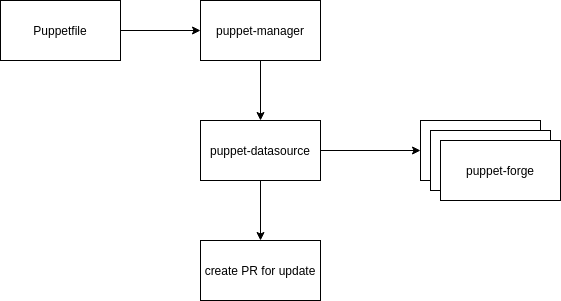

simply keeps Puppetfiles updated

# supported Puppetfile formats

the manager extracts the deps from one Puppetfile

the Puppetfile supports at the moment different ways to configure forges

1. no forge defined

```ruby
mod 'puppetlabs/apt', '8.3.0'
mod 'puppetlabs/apache', '7.0.0'
```

2. one forge defined: `forge "https://forgeapi.puppetlabs.com"`

```ruby
forge "https://forgeapi.puppetlabs.com"

mod 'puppetlabs/apt', '8.3.0'
mod 'puppetlabs/apache', '7.0.0'
mod 'puppetlabs/concat', '7.1.1'
```

3. multiple forges defined

```ruby
forge "https://forgeapi.puppetlabs.com"

mod 'puppetlabs/apt', '8.3.0'
mod 'puppetlabs/apache', '7.0.0'
mod 'puppetlabs/concat', '7.1.1'

# private forge
forge "https://forgeapi.example.com"

mod 'example/infra', '3.3.0'
```

# general overview



# possible improvements

## monorepo

at the moment we support only one Puppetfile per repository

## git-support

usually you can add the versions to a forge and use the already provided
way of updating

```ruby
# tag based
mod 'example/standalone_jar',
    :git => 'git@gitlab.example.de:puppet/example-standalone_jar',
    :tag => '0.9.0'

# branch based
mod 'example/samba',
    :git    => 'https://github.com/example/puppet-samba',
    :branch => 'stable_version'
```
