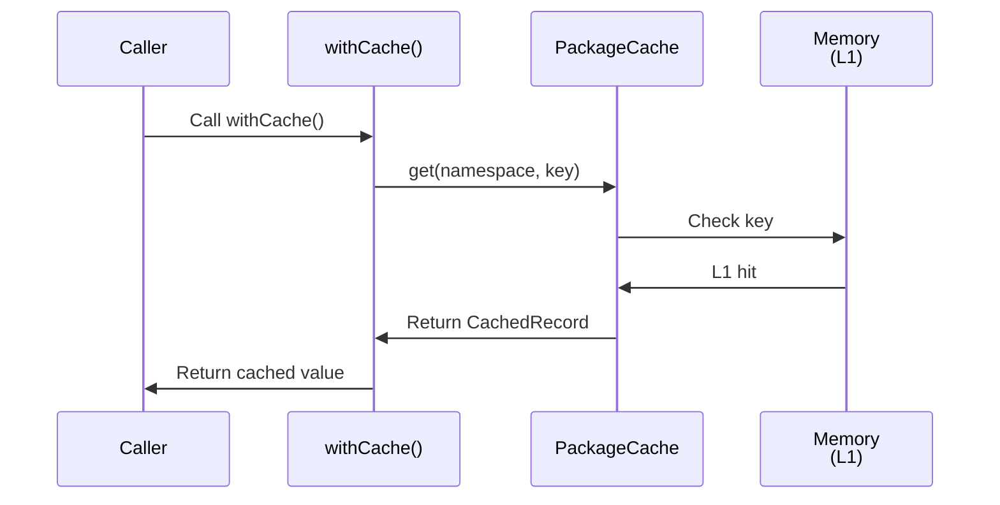
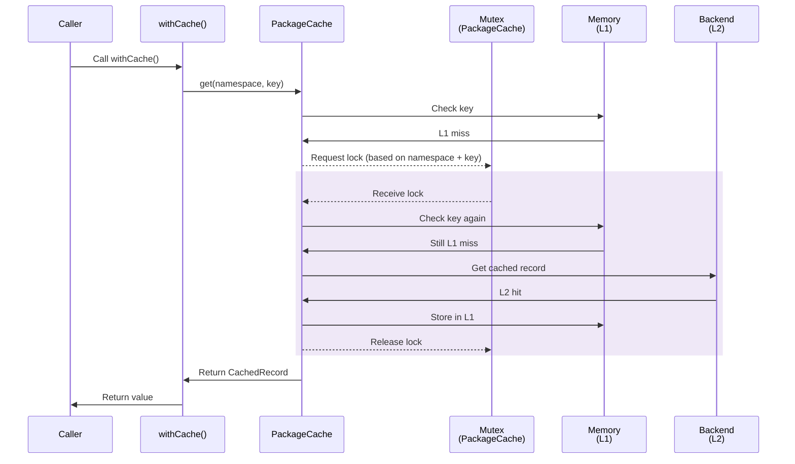
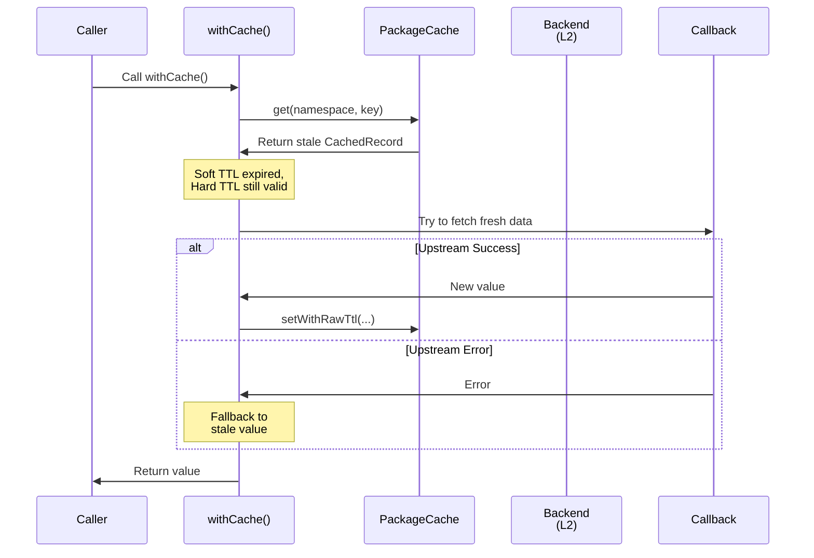
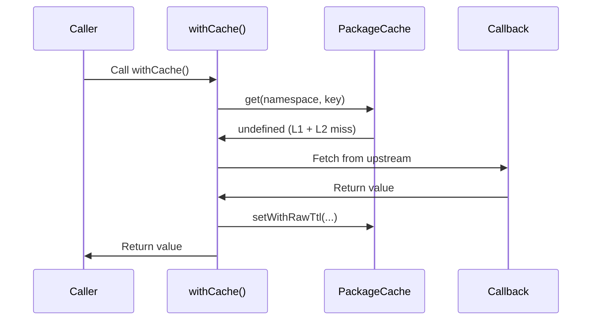
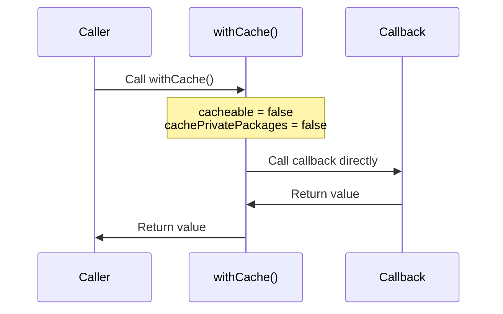
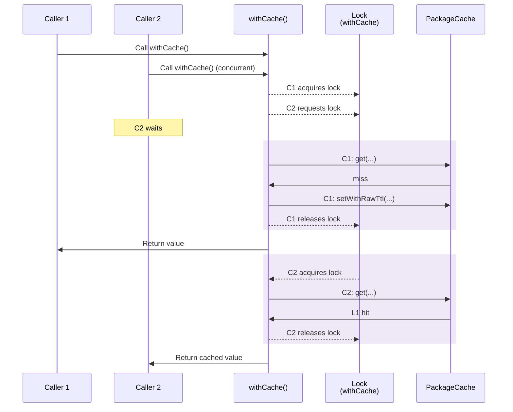
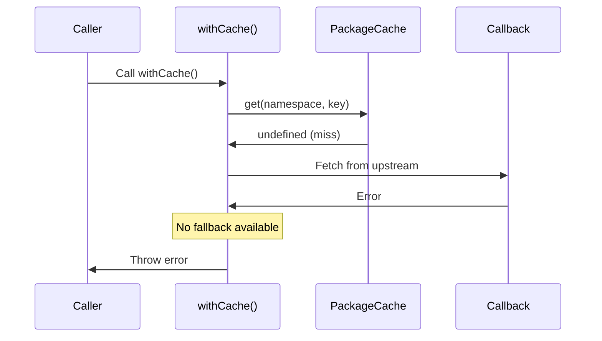
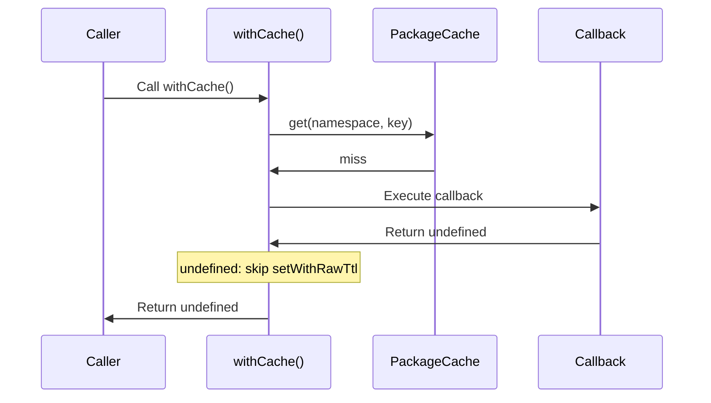
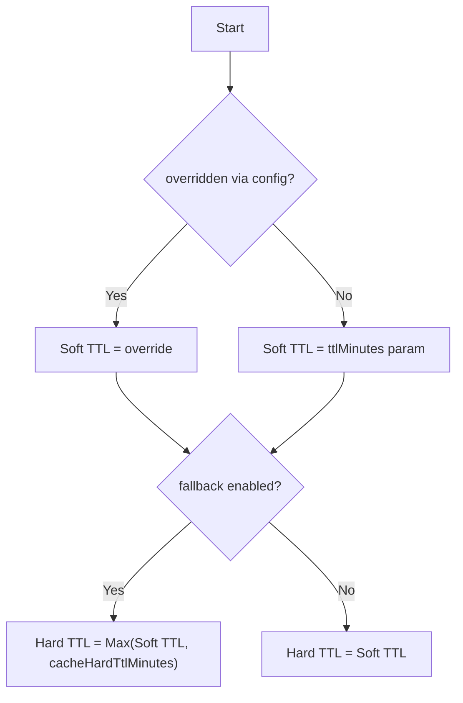

# Package Cache

Central caching mechanism for Renovate datasources and lookups. Implements a two-layer architecture:

1. **L1:** In-memory `Map` (per-process).
2. **L2:** Persistent storage (File, Redis, or SQLite).

## `PackageCache` Class

The core implementation. Wraps an optional `PackageCacheBase` backend with an L1 memory layer and mutex-guarded double-checked locking.

**Public API:**

- `get(namespace, key)` — L1 check (lock-free) → mutex → double-check L1 → backend fetch → store in L1
- `set(namespace, key, value, ttlMinutes)` — applies TTL override → mutex → write L1 + L2
- `setWithRawTtl(namespace, key, value, ttlMinutes)` — mutex → write L1 + L2, no TTL override
- `softReset()` — clears L1 only, keeping backend alive (called per-repository)
- `destroy()` — clears L1 and destroys backend

When constructed without a backend (`new PackageCache()`), it acts as a memory-only cache.
This is the default state before `init()` is called, which means CI users without configured backends still benefit from L1 dedup within a single Renovate run.

### Mutex Architecture

There are two independent mutex layers:

1. **`PackageCache` level** — `getMutex(combinedKey, 'package-cache')` in `get()`/`set()`/`setWithRawTtl()`. Serializes L1/L2 access per key.
2. **`withCache` level** — `acquireLock(cacheKey, namespace)`. Serializes the entire get-check-fetch-store cycle per key.

## TTL Handling Scope

Soft/Hard TTL logic is not isolated to `withCache`.
The HTTP cache layer in `PackageHttpCacheProvider` also resolves and applies soft/hard TTL independently (Cache-Control headers, etc.).
In `PackageCache.set()`, only TTL overrides are applied; use `setWithRawTtl` to bypass this.

## Flow Architecture

The `withCache()` function orchestrates the retrieval flow, using `PackageCache` for L1/L2 access.

### Scenario 1: L1 hit (memory)

The fastest path - data is already in memory.



### Scenario 2: L2 hit (fresh in storage)

Data is not in memory but exists in backend storage and is still fresh (within Soft TTL).



### Scenario 3: L2 hit (stale in storage)

Data has expired Soft TTL but is within Hard TTL. Attempts to refresh but falls back if callback fails.
Only active when `fallback: true` is passed to `withCache()`.



### Scenario 4: L2 miss

No cached data exists or Hard TTL has expired.



### Scenario 5: Non-cacheable calls

When `cacheable` is false (and `cachePrivatePackages` is also false), `withCache` bypasses `PackageCache` entirely and calls the callback directly.
No L1 or L2 caching occurs.



Setting `cachePrivatePackages: true` overrides this and enables caching for private packages.

### Scenario 6: Concurrent Access (Race Protection)

Multiple concurrent calls for the same key are serialized by the `withCache` lock (`acquireLock`).
Within each serialized call, `PackageCache` uses its own mutex for L1/L2 consistency.



### Scenario 7: Callback throws

When callback fails and no cached data exists to fall back on.



### Scenario 8: Callback returns `undefined` or `null`

- **`undefined`**: Not persisted to L1 or L2.
  `withCache` skips `setWithRawTtl` when the result is `undefined`.
  Treated as a transient failure that should be retried on the next run.
- **`null`**: Persisted to both L1 and L2 via `setWithRawTtl`.
  Treated as a valid result (e.g., "package not found").



## Usage

Use `withCache()` to wrap async functions with caching.

```typescript
import { withCache } from '../../../util/cache/package/with-cache';

const result = await withCache(
  {
    namespace: 'datasource-my-source',
    key: 'some-key',
    ttlMinutes: 15,
    cacheable: true,
    fallback: true,
  },
  async () => {
    // Expensive call to external source
  },
);
```

**Note:** `withCache` prefixes L2 cache keys with `cache-decorator:`.
Actual L2 key example: `datasource-my-source:cache-decorator:some-key`

### Persistence Behavior

| `cacheable` | `cachePrivatePackages` | L1 (Memory) | L2 (Disk/Redis) |
| :---------- | :--------------------- | :---------- | :-------------- |
| `true`      | `false`                | Yes         | Yes             |
| `true`      | `true`                 | Yes         | Yes             |
| `false`     | `false`                | No          | No              |
| `false`     | `true`                 | Yes         | Yes             |

When `cacheable` is `false` and `cachePrivatePackages` is `false`, caching is bypassed entirely — the callback is called directly.

## TTL Strategy (Soft vs. Hard)

Renovate uses a dual-TTL system to handle external source instability.

1. **Soft TTL (`ttlMinutes`):** Period where data is considered "fresh".
   Returned immediately without network calls.
2. **Hard TTL:** Period where data is physically retained on disk.
   Used for fallback if callback fails.

**Important:** The Stale-While-Revalidate (Hard TTL) logic is **only active** when `fallback: true` is passed to `withCache()`.
When `fallback` is false (the default), `Hard TTL = Soft TTL`.

### TTL Resolution Logic



See also: [cacheHardTtlMinutes](https://docs.renovatebot.com/self-hosted-configuration/#cachehardttlminutes)

## Configuration Overrides (`cacheTtlOverride`)

Users can override Soft TTLs via `config.js`.
The resolution uses **Longest Matching Pattern**.

| Pattern Type | Example                   | Priority         |
| :----------- | :------------------------ | :--------------- |
| Exact Match  | `datasource-npm`          | 1                |
| Glob         | `datasource-{npm,docker}` | 2 (Length based) |
| Regex        | `/^datasource-/`          | 3 (Length based) |
| Wildcard     | `*`                       | 4                |

## Backends

Backend is selected at startup based on environment and config (checked in order):

1. **Redis:** Enabled if `redisUrl` is configured (via env or CLI, see [docs](https://docs.renovatebot.com/self-hosted-configuration/#redisurl)).
2. **SQLite:** Enabled if `RENOVATE_X_SQLITE_PACKAGE_CACHE=true` and `cacheDir` is available.
3. **File:** Default fallback. Uses `cacache` with `gzip` in `cacheDir` (via env or CLI, see [docs](https://docs.renovatebot.com/self-hosted-configuration/#cachedir)).
