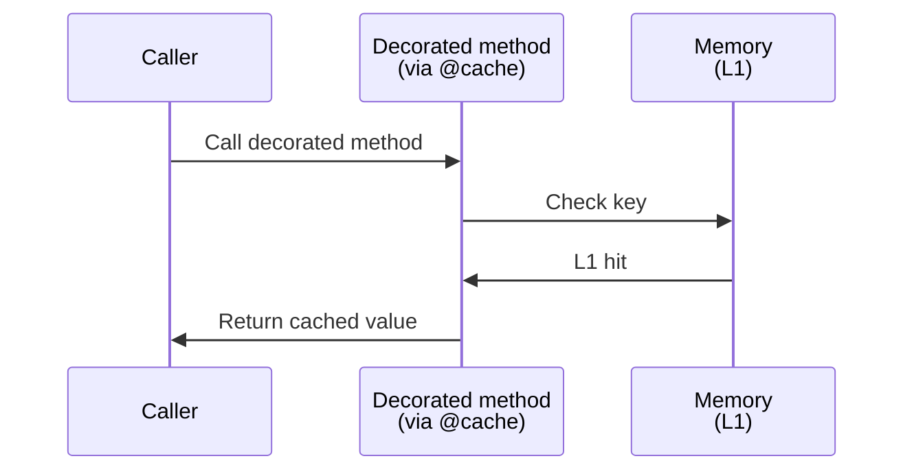
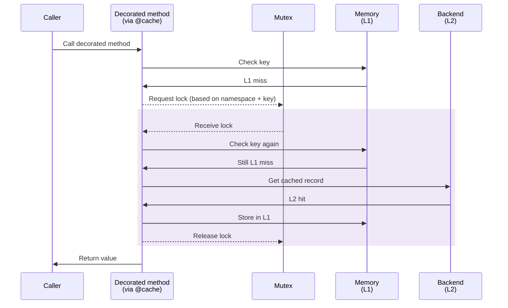
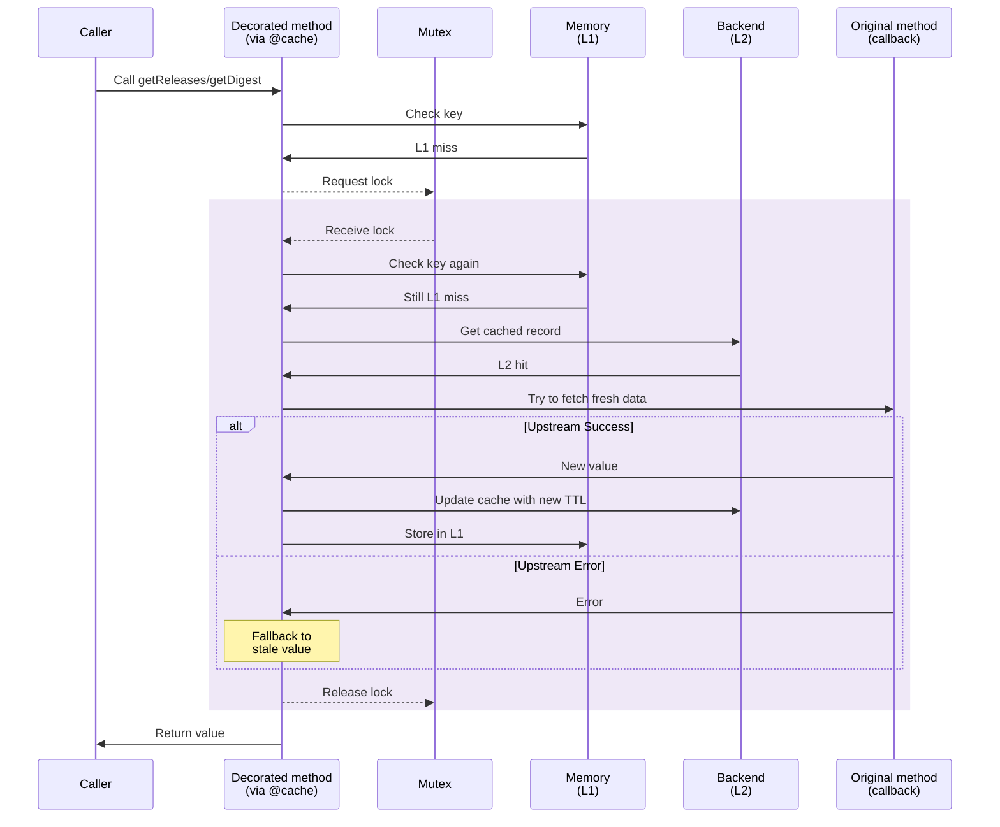
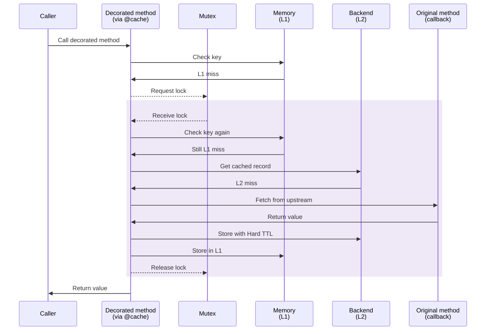
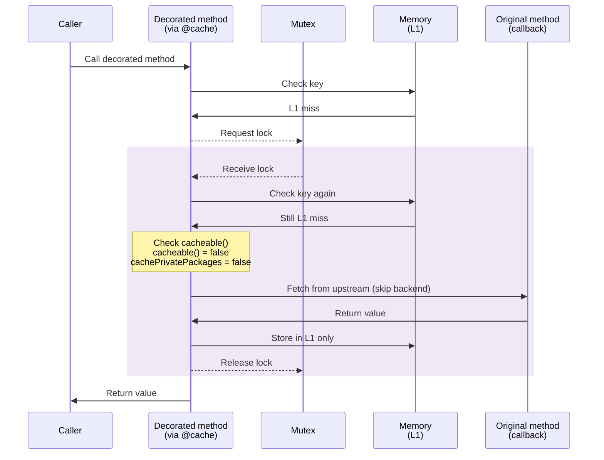
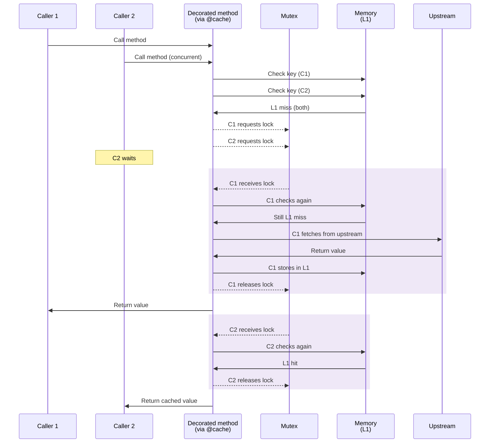
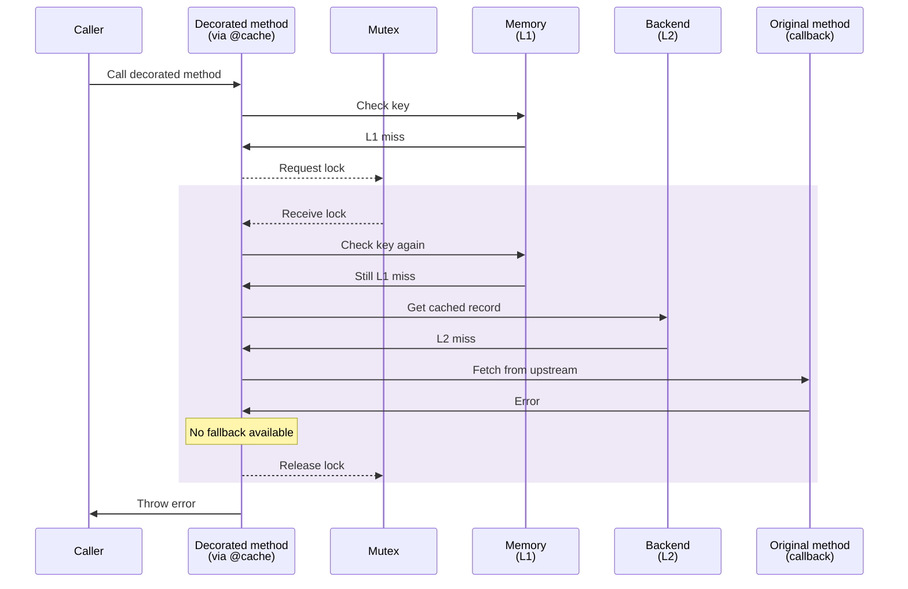
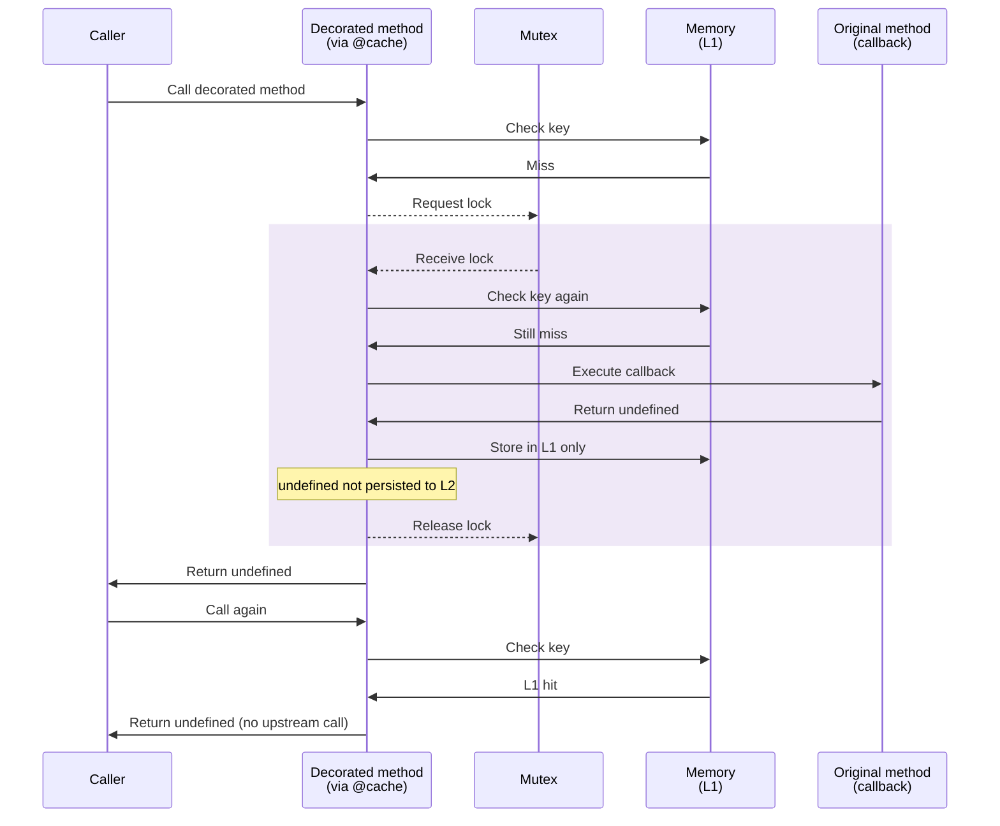
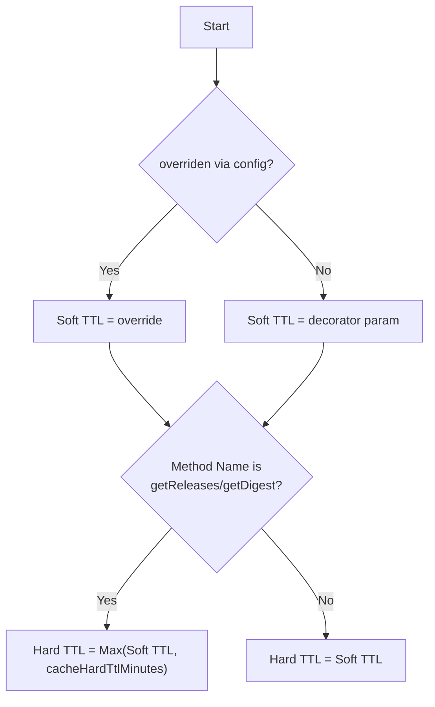

# Package Cache

Central caching mechanism for Renovate datasources and lookups. Implements a two-layer architecture:

1. **L1:** In-memory `Map` (per-process).
2. **L2:** Persistent storage (File, Redis, or SQLite).

## TTL Handling Scope

Soft/Hard TTL logic is not isolated to the `@cache` decorator.
The HTTP cache layer in `PackageHttpCacheProvider` also resolves and applies soft/hard TTL independently (Cache-Control headers, etc.).
In core caching, only TTL overrides are applied; use `setWithRawTtl` to bypass this logic.

## Flow Architecture

The `@cache` decorator orchestrates the retrieval flow.

### Scenario 1: L1 hit (memory)

The fastest path - data is already in memory.



### Scenario 2: L2 hit (fresh in storage)

Data is not in memory but exists in backend storage and is still fresh (within Soft TTL).



### Scenario 3: L2 hit (stale in storage)

**NOTE:** This is only works for `getReleases`/`getDigest` methods.
Data has expired Soft TTL but is within Hard TTL. Attempts to refresh but falls back if callback fails.



### Scenario 4: L2 miss

No cached data exists or Hard TTL has expired.



### Scenario 5: Private packages

When `cacheable()` returns false, only memory caching is used (which is reset after Renovate run). Setting `cachePrivatePackages` forces persistence of private packages (available to self-hosted users).



### Scenario 6: Concurrent Access (Race Protection)

Multiple concurrent calls for the same key - mutex ensures only one fetch. In this context, upstream is represented by both L2 and the original method (calling the actual external service).



### Scenario 7: Decorated method throws

When callback fails and no cached data exists to fall back on.



### Scenario 8: Decorated method returns special values (`undefined` or `null`)

- **`undefined`**: Cached in Memory (L1) but **never persisted** to Backend (L2). Treated as a transient failure that should be retried on the next run.
- **`null`**: Cached in both L1 and L2 (if `cacheable` returns true). Treated as a valid result (e.g., "package not found").

The diagram below illustrates the `undefined` flow:



## Usage

Apply the decorator to class methods.

```typescript
import { cache } from '../../../util/cache/package';

class MyDatasource {
  @cache({
    namespace: 'datasource-my-source', // or function(arg) => string
    key: 'some-key', // or function(arg) => string
    ttlMinutes: 15, // Soft TTL
    // Optional. Default: () => true. Controls L2 persistence. L1 (Memory) always caches.
    cacheable: (result) => result !== null,
  })
  async getTags(pkgName: string): Promise<string[]> {
    // Expensive call to external source
  }
}
```

**Note:** The decorator prefixes L2 cache keys with `cache-decorator:`. Actual L2 key example: `datasource-my-source:cache-decorator:some-key`

### Persistence vs. Memory (`cacheable`)

The `cacheable` parameter **only controls persistence (L2)**.

- If `cacheable` returns `false`, the result is still stored in **L1 Memory**.
- Private packages are treated as non-cacheable by default unless forced by config.

| `cacheable()` Result | `cachePrivatePackages` Config | L1 (Memory) | L2 (Disk/Redis) |
| :------------------- | :---------------------------- | :---------- | :-------------- |
| `true`               | `false`                       | ✅          | ✅              |
| `false`              | `false`                       | ✅          | ❌              |
| `false`              | `true`                        | ✅          | ✅              |

## TTL Strategy (Soft vs. Hard)

Renovate uses a dual-TTL system to handle external source instability.

1. **Soft TTL (`ttlMinutes`):** Period where data is considered "fresh". Returned immediately without network calls.
2. **Hard TTL:** Period where data is physically retained on disk. Used for fallback if callback fails.

**Important:** The Stale-While-Revalidate (Hard TTL) logic is **only active** for methods named:

- `getReleases`
- `getDigest`

For all other methods, `Hard TTL = Soft TTL`.

### TTL Resolution Logic



See also: [cacheHardTtlMinutes](https://docs.renovatebot.com/self-hosted-configuration/#cachehardttlminutes)

## Configuration Overrides (`cacheTtlOverride`)

Users can override Soft TTLs via `config.js`. The resolution uses **Longest Matching Pattern**.

| Pattern Type | Example                   | Priority         |
| :----------- | :------------------------ | :--------------- |
| Exact Match  | `datasource-npm`          | 1                |
| Glob         | `datasource-{npm,docker}` | 2 (Length based) |
| Regex        | `/^datasource-/`          | 3 (Length based) |
| Wildcard     | `*`                       | 4                |

## Backends

Backend is selected at startup based on environment and config (checked in order):

1. **Redis:** Enabled if `redisUrl` is configured (via env or CLI, see [docs](https://docs.renovatebot.com/self-hosted-configuration/#redisurl)).
2. **SQLite:** Enabled if `RENOVATE_X_SQLITE_PACKAGE_CACHE=true` and `cacheDir` is available.
3. **File:** Default fallback. Uses `cacache` with `gzip` in `cacheDir` (via env or CLI, see [docs](https://docs.renovatebot.com/self-hosted-configuration/#cachedir)).
