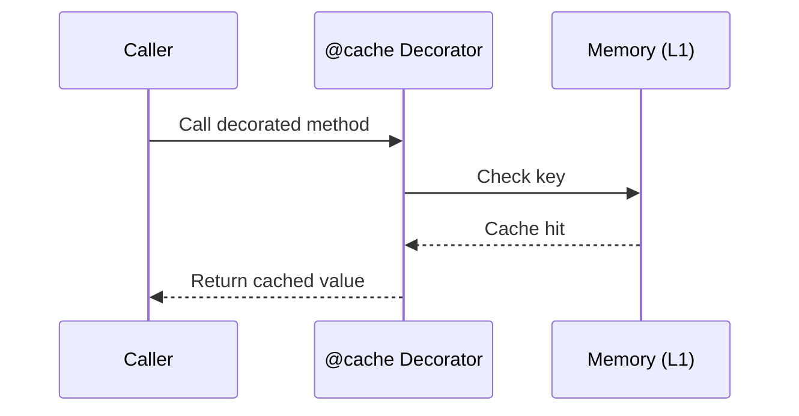
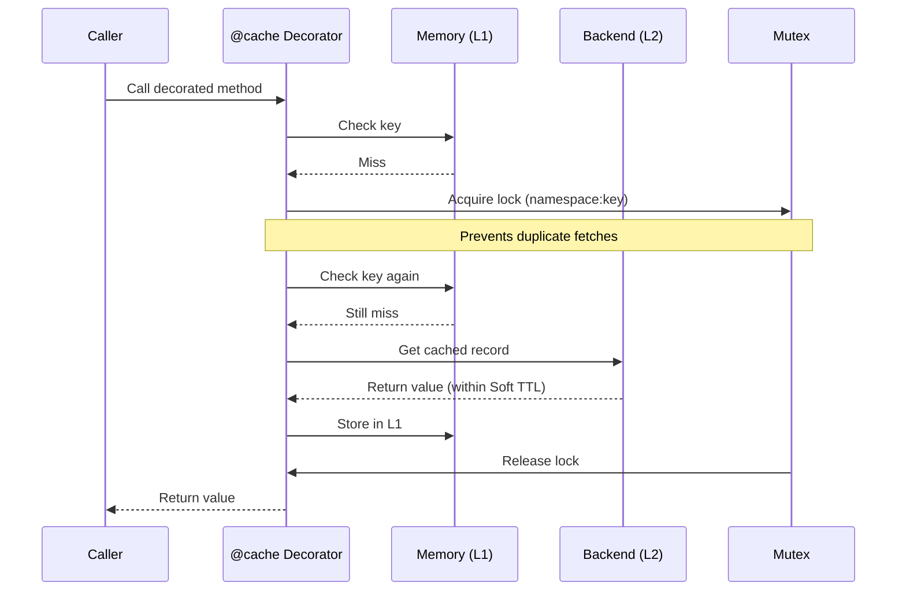
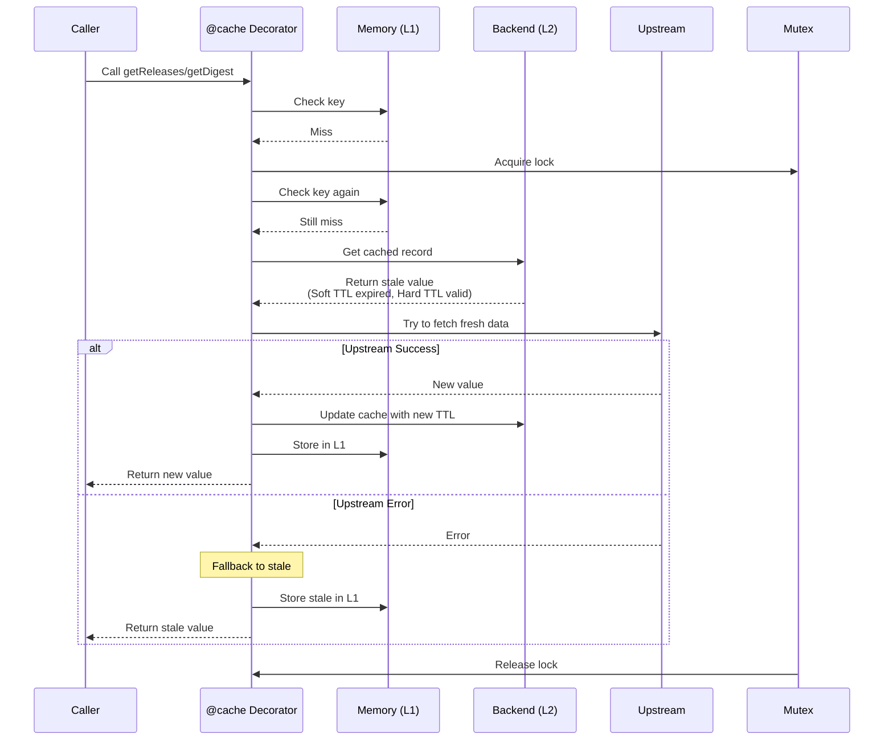
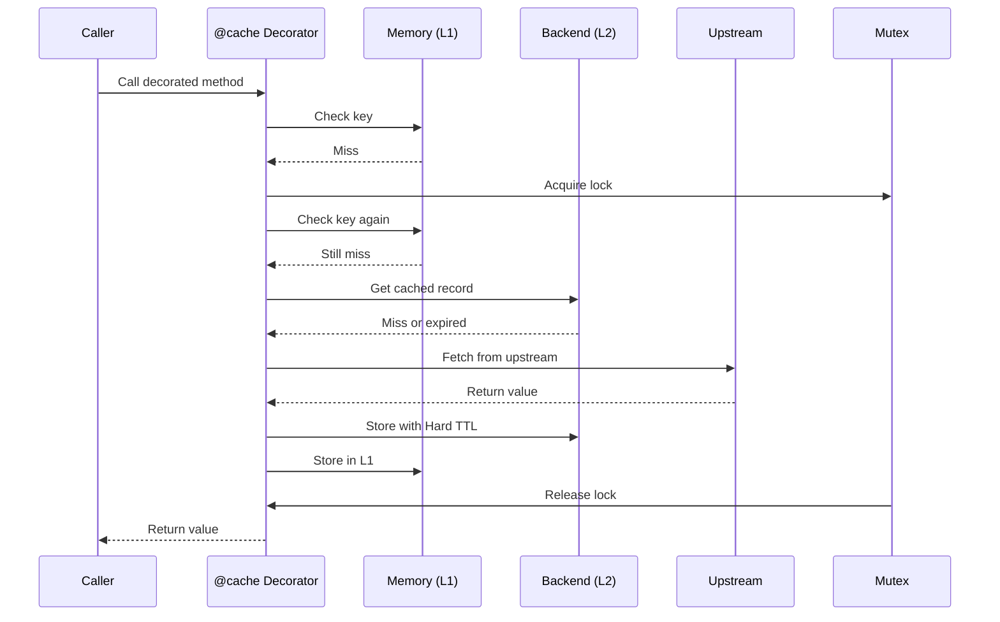
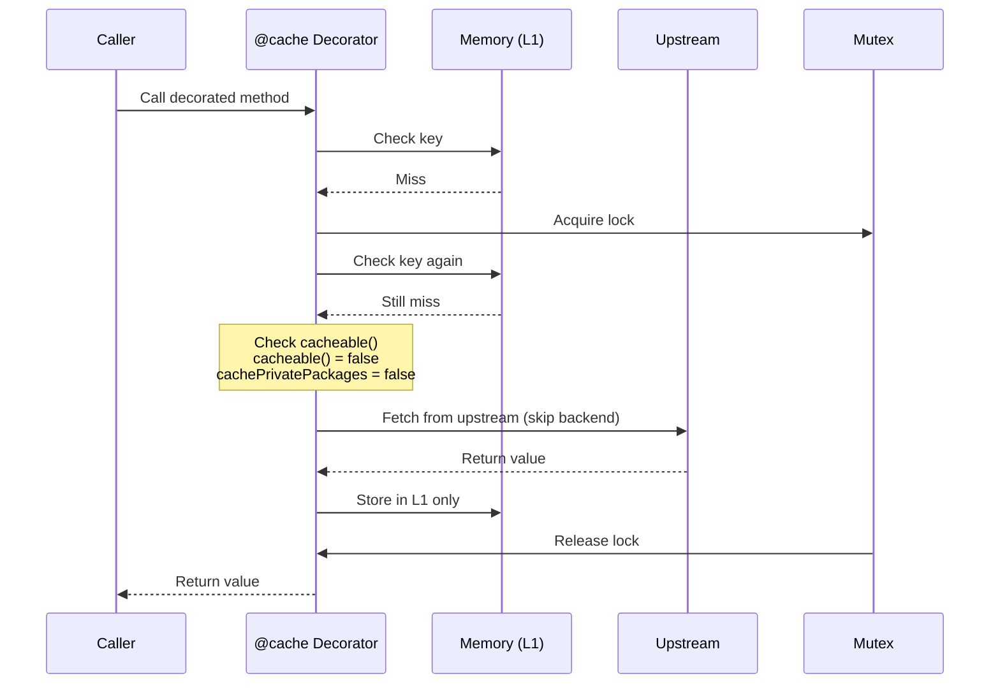
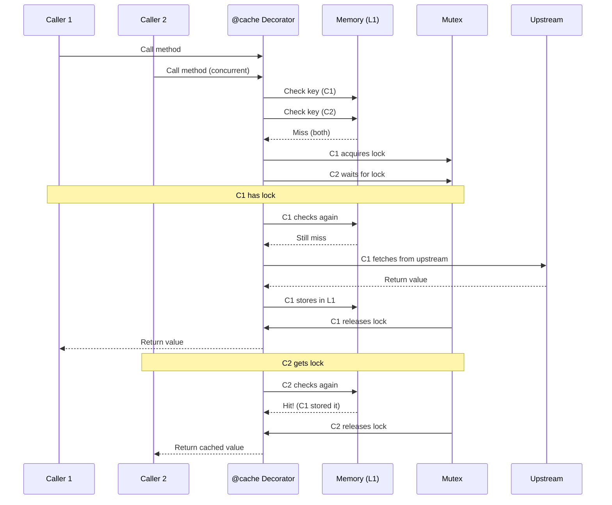
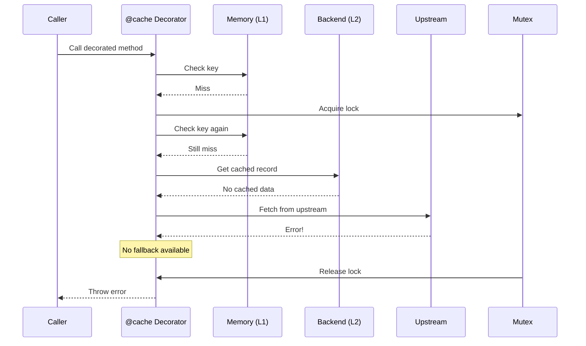
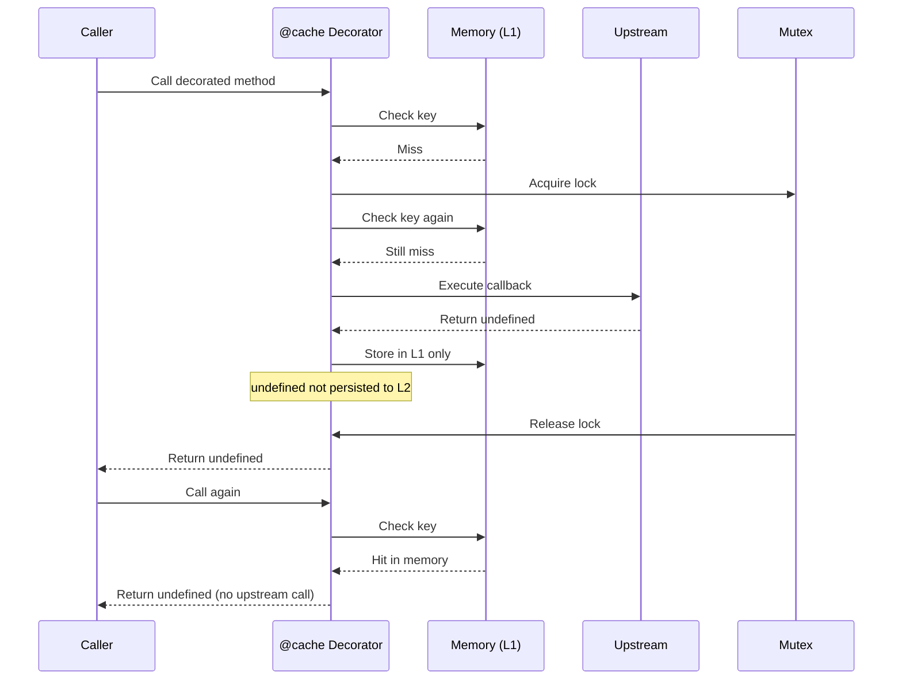
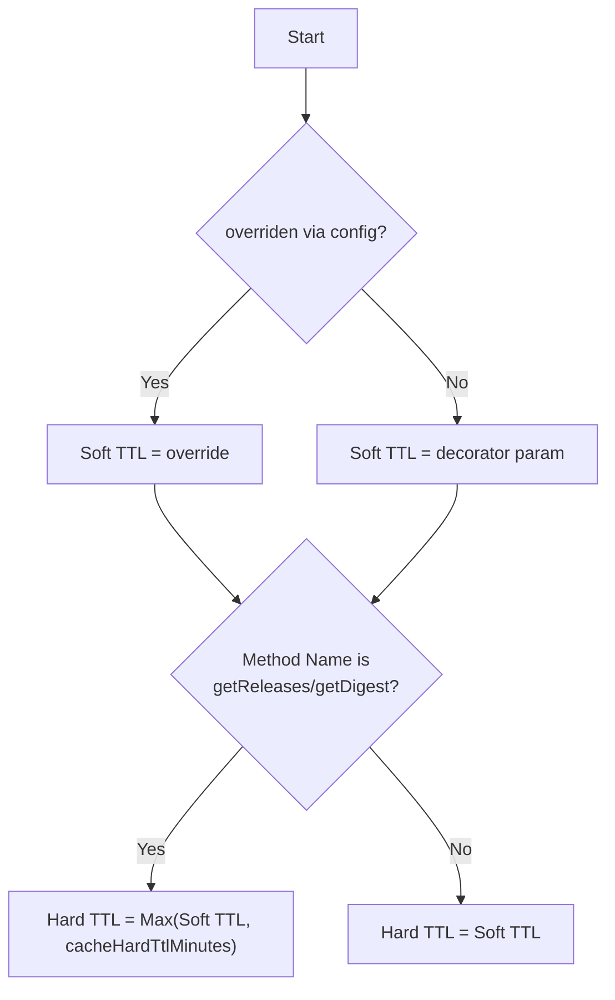

# Package Cache

Central caching mechanism for Renovate datasources and lookups. Implements a two-layer architecture:

1.  **L1:** In-memory `Map` (per-process).
2.  **L2:** Persistent storage (File, Redis, or SQLite).

## TTL Handling Scope

Soft/Hard TTL logic is not isolated to the `@cache` decorator.
The HTTP cache layer in `PackageHttpCacheProvider` also resolves and applies soft/hard TTL independently (Cache-Control headers, etc.).
In core caching, only TTL overrides are applied; use `setWithRawTtl` to bypass this logic.

## Flow Architecture

The `@cache` decorator orchestrates the retrieval flow.

### Scenario 1: L1 Memory Cache Hit

The fastest path - data is already in memory.



### Scenario 2: L2 Cache Hit (Fresh)

Data is not in memory but exists in backend storage and is still fresh (within Soft TTL).



### Scenario 3: L2 Cache Hit (Stale) - Only for getReleases/getDigest

Data has expired Soft TTL but is within Hard TTL. Attempts to refresh but falls back if upstream fails.



### Scenario 4: L2 Cache Miss

No cached data exists or Hard TTL has expired.



### Scenario 5: Non-Cacheable Items

When `cacheable()` returns false, only memory caching is used (unless `cachePrivatePackages` is true).



### Scenario 6: Concurrent Access (Race Protection)

Multiple concurrent calls for the same key - mutex ensures only one upstream fetch.



### Scenario 7: Upstream Error (No Fallback)

When upstream fails and no cached data exists to fall back on.



### Scenario 8: Special Values (undefined)

Undefined values are cached in memory (L1) but never persisted to backend (L2). This prevents repeated upstream calls within a single run while treating undefined as a potential transient failure that should not survive between runs.



## Usage

Apply the decorator to class methods.

```typescript
import { cache } from '../../../util/cache/package';

class MyDatasource {
  @cache({
    namespace: 'datasource-my-source', // or function(arg) => string
    key: 'some-key', // or function(arg) => string
    ttlMinutes: 15, // Soft TTL
    cacheable: (result) => result !== null, // Optional
  })
  async getTags(pkgName: string): Promise<string[]> {
    // Expensive upstream call
  }
}
```

### Persistence vs. Memory (`cacheable`)

The `cacheable` parameter **only controls persistence (L2)**.

- If `cacheable` returns `false`, the result is still stored in **L1 Memory** for the duration of the process.
- Private packages are treated as non-cacheable by default unless forced by config.

| `cacheable()` Result | `cachePrivatePackages` Config | L1 (Memory) | L2 (Disk/Redis) |
| :------------------- | :---------------------------- | :---------- | :-------------- |
| `true`               | `false`                       | ✅          | ✅              |
| `false`              | `false`                       | ✅          | ❌              |
| `false`              | `true`                        | ✅          | ✅              |

## TTL Strategy (Soft vs. Hard)

Renovate uses a dual-TTL system to handle upstream instability.

1.  **Soft TTL (`ttlMinutes`):** Period where data is considered "fresh". Returned immediately without network calls.
2.  **Hard TTL:** Period where data is physically retained on disk. Used for fallback if upstream fails.

**Important:** The Stale-While-Revalidate (Hard TTL) logic is **only active** for methods named:

- `getReleases`
- `getDigest`

For all other methods, `HardTTL = SoftTTL`.

### TTL Resolution Logic



## Configuration Overrides (`cacheTtlOverride`)

Users can override Soft TTLs via `config.js`. The resolution uses **Longest Matching Pattern**.

| Pattern Type | Example                   | Priority         |
| :----------- | :------------------------ | :--------------- |
| Exact Match  | `datasource-npm`          | 1                |
| Glob         | `datasource-{npm,docker}` | 2 (Length based) |
| Regex        | `/^datasource-/`          | 3 (Length based) |
| Wildcard     | `*`                       | 4                |

## Backends

Backend is selected at startup based on environment and config:

1.  **Redis:** if `redisUrl` is configured.
2.  **SQLite:** if `RENOVATE_X_SQLITE_PACKAGE_CACHE=true`.
3.  **File:** Default. Uses `cacache` with `gzip`.
